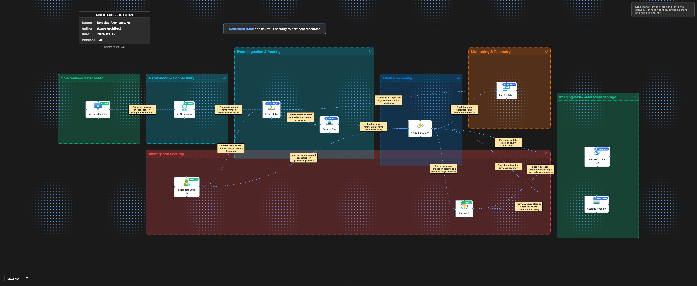

# 🔍 Azure Architecture Validation Report

**Generated:** 2026-02-12, 4:42:11 p.m.

## 🖼️ Architecture Diagram

---

## 📊 Executive Summary

### Overall Score: 78/100

🟡 **Assessment:** The architecture demonstrates a strong foundation in security and modern cloud design, leveraging managed identity and Key Vault for secret management. While the solution adequately addresses core workloads, there are some gaps in redundancy, cost management, and performance optimization that, if addressed, will further strengthen reliability, efficiency, and operational agility.

### Pillar Scores at a Glance

| Pillar | Score | Status |
|--------|-------|--------|
| Reliability | 72/100 | ⚠️ Needs Improvement |
| Security | 85/100 | ✅ Good |
| Cost Optimization | 74/100 | ⚠️ Needs Improvement |
| Operational Excellence | 78/100 | ⚠️ Needs Improvement |
| Performance Efficiency | 80/100 | ✅ Good |

---

## 🏗️ Detailed Assessment by Pillar

### 1. Reliability (72/100)

🟠 **High Availability** [HIGH]

**Issue:**  
Key workloads (Event Hubs, Cosmos DB, Azure Functions) are not explicitly deployed across multiple regions or availability zones.

**Recommendation:**  
Enable geo-redundancy and configure Always On/Zone Redundant deployments in Event Hubs, Cosmos DB, and Azure Functions to minimize downtime risks.

**Affected Resources:**
- Event Hubs
- Azure Functions
- Azure Cosmos DB

---

🟡 **Disaster Recovery** [MEDIUM]

**Issue:**  
There is no stated backup or geo-replication strategy for Storage Account and Cosmos DB.

**Recommendation:**  
Implement periodic backups and enable geo-replication for Storage Accounts and configure Continuous Backup or multi-region writes for Cosmos DB.

**Affected Resources:**
- Azure Cosmos DB
- Storage Account

---

### 2. Security (85/100)

🟠 **Identity & Access Management** [HIGH]

**Issue:**  
Direct assignment of secrets from Key Vault to resources is enabled, but periodic access reviews and Key Vault monitoring are not described.

**Recommendation:**  
Configure Key Vault access policies with least privilege, enable logging, and schedule periodic access policy reviews.

**Affected Resources:**
- Key Vault
- Microsoft Entra ID

---

🟡 **Network Security** [MEDIUM]

**Issue:**  
Storage Account and other data endpoints are not explicitly restricted to private endpoints or trusted subnets.

**Recommendation:**  
Restrict Storage Account, Cosmos DB, and Key Vault to allow access only from private endpoints or selected VNets/subnets.

**Affected Resources:**
- Storage Account
- Azure Cosmos DB
- Key Vault

---

### 3. Cost Optimization (74/100)

🟡 **Right-Sizing** [MEDIUM]

**Issue:**  
Azure Functions may not be optimally configured for workload variance, and reserved pricing is not mentioned for persistent resources.

**Recommendation:**  
Review Azure Functions plan and consider Consumption plan for variable loads; purchase reserved capacity for consistent usage on Event Hubs and Cosmos DB.

**Affected Resources:**
- Azure Functions
- Event Hubs
- Azure Cosmos DB

---

🟢 **Resource Utilization** [LOW]

**Issue:**  
Log Analytics costs can grow quickly without granularity controls.

**Recommendation:**  
Review Log Analytics retention and data collection policies to reduce unneeded ingestion and lower costs.

**Affected Resources:**
- Log Analytics

---

### 4. Operational Excellence (78/100)

🟡 **Monitoring & Logging** [MEDIUM]

**Issue:**  
Application insights and proactive alerting on failure scenarios are not specified.

**Recommendation:**  
Integrate Azure Monitor and Application Insights for Azure Functions, Event Hubs, Cosmos DB; implement proactive alerting for ingestion, processing, and storage failures.

**Affected Resources:**
- Azure Functions
- Event Hubs
- Azure Cosmos DB

---

🟡 **Automation** [MEDIUM]

**Issue:**  
No automation is indicated for deployment, scaling, or regular maintenance tasks.

**Recommendation:**  
Implement deployment automation using Azure DevOps or GitHub Actions; automate scheduled scaling and routine maintenance (e.g., key rotation).

**Affected Resources:**
- Azure Functions
- Key Vault

---

### 5. Performance Efficiency (80/100)

🟡 **Scaling** [MEDIUM]

**Issue:**  
Azure Functions and Event Hubs are not explicitly configured for auto-scaling to handle bursts in event workloads.

**Recommendation:**  
Enable auto-scaling for Event Hubs and adjust Azure Functions scaling limits; leverage throughput control for Cosmos DB.

**Affected Resources:**
- Event Hubs
- Azure Functions
- Azure Cosmos DB

---

🟢 **Caching** [LOW]

**Issue:**  
No mention of caching strategies, which could reduce database and storage load.

**Recommendation:**  
Implement in-memory or distributed caching where possible (e.g., for commonly accessed metadata) to reduce read latency on Cosmos DB.

**Affected Resources:**
- Azure Functions
- Azure Cosmos DB

---

## ⚡ Quick Wins - Immediate Action Items

These are high-impact, low-effort improvements you can implement right away:

### 1. Security

Immediately restrict Storage Account, Key Vault, and Cosmos DB to private endpoints in the VNet.

### 2. Operational Excellence

Configure basic Azure Monitor alerts for Function failures and message dead-lettering in Event Hubs and Service Bus.

### 3. Cost Optimization

Switch Azure Functions to the Consumption plan for workflows with unpredictable or variable utilization.

---

## 📚 Additional Resources

- [Azure Well-Architected Framework](https://learn.microsoft.com/azure/architecture/framework/)
- [Azure Architecture Center](https://learn.microsoft.com/azure/architecture/)
- [Azure Security Benchmark](https://learn.microsoft.com/security/benchmark/azure/)

---

*Report generated by Azure Architecture Diagram Builder*  
*Powered by GPT-4.1 and Azure Well-Architected Framework*  
*Generated: 2026-02-12, 4:42:11 p.m.*
