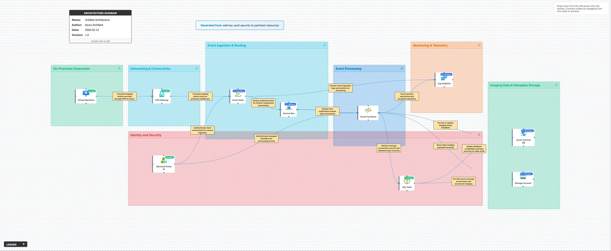

# 🔍 Azure Architecture Validation Report

**Generated:** 2026-02-12, 4:44:18 p.m.

## 🖼️ Architecture Diagram

---

## 📊 Executive Summary

### Overall Score: 78/100

🟡 **Assessment:** The architecture shows strong security practices by integrating Azure Key Vault for secrets management and using Entra ID for identity. Reliability is moderate due to potential single-region dependency and gaps in geo-redundancy. Cost optimization has some room for improvement, especially around compute resources and reserved instances. Operational excellence is fair with Log Analytics implemented, but automation and alerting can be strengthened. Performance can be improved by reviewing scaling and throughput configurations.

### Pillar Scores at a Glance

| Pillar | Score | Status |
|--------|-------|--------|
| Reliability | 75/100 | ⚠️ Needs Improvement |
| Security | 85/100 | ✅ Good |
| Cost Optimization | 65/100 | ⚠️ Needs Improvement |
| Operational Excellence | 80/100 | ✅ Good |
| Performance Efficiency | 85/100 | ✅ Good |

---

## 🏗️ Detailed Assessment by Pillar

### 1. Reliability (75/100)

🟠 **Disaster Recovery** [HIGH]

**Issue:**  
Most services are implied to be deployed in a single region with no stated geo-redundancy.

**Recommendation:**  
Enable geo-replication for Cosmos DB and Storage Account; deploy critical workloads (Event Hubs, Service Bus, Azure Functions) across multiple availability zones.

**Affected Resources:**
- Azure Cosmos DB
- Storage Account
- Event Hubs
- Service Bus
- Azure Functions

---

🟡 **Backup & Restore** [MEDIUM]

**Issue:**  
No mention of backup for Cosmos DB, Storage Account, or configuration data.

**Recommendation:**  
Configure automated backup and point-in-time restore for Cosmos DB and Storage Account.

**Affected Resources:**
- Azure Cosmos DB
- Storage Account

---

### 2. Security (85/100)

🟡 **Identity & Access Management** [MEDIUM]

**Issue:**  
Some resources access Key Vault via Azure Functions, but not all resources mention Managed Identities.

**Recommendation:**  
Enforce Managed Identities for all resource-to-Key Vault access and apply least privilege policies.

**Affected Resources:**
- Azure Functions
- Event Hubs
- Service Bus
- Azure Cosmos DB
- Storage Account

---

🟡 **Secret Rotation** [MEDIUM]

**Issue:**  
No mention of automated secret rotation policy in Key Vault.

**Recommendation:**  
Enable secret and key rotation in Azure Key Vault and implement alerts for expired credentials.

**Affected Resources:**
- Key Vault

---

🟡 **Network Security** [MEDIUM]

**Issue:**  
No network isolation (Private Endpoints, VNET Integration) for database and storage endpoints.

**Recommendation:**  
Enable Private Endpoint or Service Endpoint for Cosmos DB and Storage Account, restricting public access.

**Affected Resources:**
- Azure Cosmos DB
- Storage Account

---

### 3. Cost Optimization (65/100)

🟡 **Compute Sizing** [MEDIUM]

**Issue:**  
Azure Functions plan model not specified; possibly using Premium or App Service Plan.

**Recommendation:**  
Evaluate workload and consider Azure Functions Consumption plan for event-driven workloads to minimize costs.

**Affected Resources:**
- Azure Functions

---

🟡 **Reserved Capacity** [MEDIUM]

**Issue:**  
No mention of reserved instances/capacity for Event Hubs, Service Bus, or Cosmos DB.

**Recommendation:**  
Purchase reserved capacity for predictable workloads (e.g., Cosmos DB RU/s, Event Hubs Throughput Units).

**Affected Resources:**
- Event Hubs
- Service Bus
- Azure Cosmos DB

---

### 4. Operational Excellence (80/100)

🟢 **Monitoring & Alerts** [LOW]

**Issue:**  
Application and infrastructure logs are collected, but no mention of auto-healing actions or alerting.

**Recommendation:**  
Implement actionable alerts in Log Analytics and consider auto-restart or Azure Automation runbooks for healing.

**Affected Resources:**
- Azure Functions
- Log Analytics

---

🟡 **Deployment & DevOps** [MEDIUM]

**Issue:**  
No mention of Infrastructure as Code (IaC) or automated deployment pipelines.

**Recommendation:**  
Adopt Bicep or ARM templates with Azure DevOps or GitHub Actions for CI/CD.

**Affected Resources:**
- All services

---

### 5. Performance Efficiency (85/100)

🟡 **Scaling** [MEDIUM]

**Issue:**  
Throughput units/scale settings not mentioned for Event Hubs, Service Bus, or Cosmos DB.

**Recommendation:**  
Monitor traffic and apply autoscale or adjust throughput units and RU/s settings for anticipated spikes.

**Affected Resources:**
- Event Hubs
- Service Bus
- Azure Cosmos DB

---

🟢 **Caching** [LOW]

**Issue:**  
No in-memory cache for frequently accessed metadata.

**Recommendation:**  
Consider integrating Azure Cache for Redis where low-latency access to frequently used metadata is needed.

**Affected Resources:**
- Azure Cosmos DB

---

## ⚡ Quick Wins - Immediate Action Items

These are high-impact, low-effort improvements you can implement right away:

### 1. Cost Optimization

Switch Azure Functions to Consumption plan if processing is event-driven and intermittent.

### 2. Security

Enable Private Endpoints for Cosmos DB and Storage Account to prevent public network access.

### 3. Operational Excellence

Set up Log Analytics alerts for error rates, throughput throttling, and function failures.

### 4. Security

Enable Key Vault secret rotation policies.

---

## 📚 Additional Resources

- [Azure Well-Architected Framework](https://learn.microsoft.com/azure/architecture/framework/)
- [Azure Architecture Center](https://learn.microsoft.com/azure/architecture/)
- [Azure Security Benchmark](https://learn.microsoft.com/security/benchmark/azure/)

---

*Report generated by Azure Architecture Diagram Builder*  
*Powered by GPT-4.1 and Azure Well-Architected Framework*  
*Generated: 2026-02-12, 4:44:18 p.m.*
