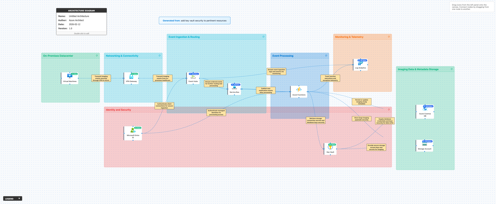

# 🔍 Azure Architecture Validation Report

**Generated:** 2026-02-12, 4:47:35 p.m.

## 🖼️ Architecture Diagram

---

## 📊 Executive Summary

### Overall Score: 72/100

🟡 **Assessment:** The architecture is solid for event-driven ingestion and processing, with good service selection and a clear identity and telemetry baseline. Key gaps are around end-to-end private networking, multi-region resiliency/DR, and tightening secret/credential practices by standardizing on managed identity + Key Vault with rotation and removing key-based access where possible.

### Pillar Scores at a Glance

| Pillar | Score | Status |
|--------|-------|--------|
| Reliability | 68/100 | ⚠️ Needs Improvement |
| Security | 70/100 | ⚠️ Needs Improvement |
| Cost Optimization | 73/100 | ⚠️ Needs Improvement |
| Operational Excellence | 74/100 | ⚠️ Needs Improvement |
| Performance Efficiency | 75/100 | ⚠️ Needs Improvement |

---

## 🏗️ Detailed Assessment by Pillar

### 1. Reliability (68/100)

🟠 **Disaster Recovery** [HIGH]

**Issue:**  
No multi-region DR strategy is defined for Event Hubs, Service Bus, Functions, Cosmos DB, and Storage; a regional outage could halt ingestion/processing and risk data loss/backlog growth.

**Recommendation:**  
Define RTO/RPO per workload and implement geo-redundancy: use paired-region strategy; enable Cosmos DB multi-region with automatic failover (as required), Storage GRS/GZRS with tested failover procedures, and plan messaging DR (Service Bus Premium Geo-DR where needed). Add an alternate ingestion path and documented failover runbooks with periodic DR drills.

**Affected Resources:**
- Event Hubs
- Service Bus
- Azure Functions
- Azure Cosmos DB
- Storage Account
- VPN Gateway

---

🟠 **High Availability** [HIGH]

**Issue:**  
Availability Zone (AZ) redundancy is not specified for zone-capable services, increasing exposure to datacenter-level failures.

**Recommendation:**  
Enable zone redundancy where available: deploy VPN Gateway in zone-redundant configuration (SKU permitting), use zone-redundant Event Hubs/Service Bus (Premium where required), configure Functions plan/hosting for zone resiliency (or App Service zone redundancy), and use ZRS for Storage where appropriate.

**Affected Resources:**
- VPN Gateway
- Event Hubs
- Service Bus
- Azure Functions
- Storage Account

---

🟡 **Backpressure & Load Shedding** [MEDIUM]

**Issue:**  
No explicit strategy for throttling, retries, poison messages, and backlog management across Event Hubs → Service Bus → Functions; this can cause cascading failures during spikes.

**Recommendation:**  
Define end-to-end retry policies and idempotency, implement DLQs/poison handling, configure Service Bus max delivery counts, use Functions concurrency controls, and add autoscale rules based on backlog/lag. Consider using Service Bus sessions if ordering is required, or partitioning strategies in Event Hubs to preserve order per key.

**Affected Resources:**
- Event Hubs
- Service Bus
- Azure Functions

---

🟡 **Data Protection & Recovery** [MEDIUM]

**Issue:**  
Backup/restore and point-in-time recovery requirements for imaging metadata and payloads are not described, risking inability to recover from corruption or accidental deletion.

**Recommendation:**  
Enable and test Cosmos DB continuous backup (or periodic backups), configure Storage soft delete/versioning/immutability as required by compliance, and document restore procedures with regular validation.

**Affected Resources:**
- Azure Cosmos DB
- Storage Account

---

### 2. Security (70/100)

🟠 **Network Security / Private Access** [HIGH]

**Issue:**  
Service access paths are not specified as private; without Private Endpoints and controlled egress, data paths may traverse public endpoints (even if encrypted), increasing exposure and complicating compliance.

**Recommendation:**  
Adopt private-by-default: enable Private Endpoints for Event Hubs, Service Bus, Cosmos DB, Storage, Key Vault, and Log Analytics ingestion where supported; integrate with Private DNS zones; restrict public network access; route Azure Functions outbound via VNet Integration + NAT Gateway/Azure Firewall and lock down egress to only required private endpoints.

**Affected Resources:**
- Event Hubs
- Service Bus
- Azure Cosmos DB
- Storage Account
- Key Vault
- Log Analytics
- Azure Functions

---

🟠 **Secrets & Key-Based Access** [HIGH]

**Issue:**  
The design references retrieving storage connection secrets and database keys; reliance on account keys/connection strings increases blast radius and rotation burden.

**Recommendation:**  
Prefer Microsoft Entra ID + RBAC over keys: use managed identity from Azure Functions to access Storage (Azure RBAC), Cosmos DB (Entra RBAC where applicable), Event Hubs/Service Bus (RBAC), and Key Vault (RBAC). Reduce stored secrets to only what cannot be replaced, enforce automated rotation, and monitor secret access.

**Affected Resources:**
- Microsoft Entra ID
- Azure Functions
- Storage Account
- Azure Cosmos DB
- Event Hubs
- Service Bus
- Key Vault

---

🟠 **Data Encryption / Customer-Managed Keys** [HIGH]

**Issue:**  
Key Vault is present but the use of customer-managed keys (CMK), HSM-backed keys, and encryption governance for regulated healthcare data is not defined.

**Recommendation:**  
Use Key Vault (or Managed HSM for stricter requirements) for CMK where supported: enable CMK for Storage, Cosmos DB, Event Hubs/Service Bus (where applicable), and enforce key rotation policies. Implement separation of duties on key management and enable purge protection + soft delete with appropriate retention.

**Affected Resources:**
- Key Vault
- Storage Account
- Azure Cosmos DB
- Event Hubs
- Service Bus

---

🟡 **Identity Governance** [MEDIUM]

**Issue:**  
Least-privilege role assignments and privileged access controls are not described; unmanaged growth of permissions can lead to over-privilege.

**Recommendation:**  
Implement least privilege with RBAC roles scoped to resource/group level, use Privileged Identity Management (PIM) for admin roles, enforce Conditional Access and MFA for operators, and periodically review access via Access Reviews.

**Affected Resources:**
- Microsoft Entra ID
- Key Vault
- Azure Cosmos DB
- Storage Account
- Event Hubs
- Service Bus
- Log Analytics

---

🟡 **Threat Protection & Monitoring** [MEDIUM]

**Issue:**  
Security monitoring controls (Defender plans, Sentinel integration, audit logging baselines) are not specified.

**Recommendation:**  
Enable Microsoft Defender for Cloud plans for Storage, Cosmos DB, Key Vault, and compute; forward security logs to Log Analytics (and Sentinel if used); create alerts for anomalous key vault access, failed auth spikes, and data exfil patterns.

**Affected Resources:**
- Log Analytics
- Storage Account
- Azure Cosmos DB
- Key Vault
- Virtual Machines
- Azure Functions

---

### 3. Cost Optimization (73/100)

🟠 **Messaging Tier & Capacity** [HIGH]

**Issue:**  
Event Hubs and Service Bus capacity/tier selection is not justified; overprovisioning (Premium/large throughput) or underprovisioning (causing throttling) can drive costs or reliability incidents.

**Recommendation:**  
Baseline ingestion rate, peak burst, and retention; right-size Event Hubs throughput units (or dedicated capacity if needed) and Service Bus tier. Use autoscale where applicable and set alerts for throttling/ServerBusy to tune capacity.

**Affected Resources:**
- Event Hubs
- Service Bus

---

🟡 **Compute Right-Sizing** [MEDIUM]

**Issue:**  
VM usage is not defined; VMs can become a cost hotspot if always-on or oversized.

**Recommendation:**  
Inventory VM roles; right-size SKUs, enable auto-shutdown for non-prod, consider reserved instances/savings plans for steady workloads, and evaluate replacing some VM functions with PaaS where feasible.

**Affected Resources:**
- Virtual Machines

---

🟡 **Functions Hosting & Scaling** [MEDIUM]

**Issue:**  
Functions plan selection and scaling limits are unspecified; inefficient plans can increase cost during idle or spikes.

**Recommendation:**  
Use Consumption or Premium based on latency/VNet requirements; configure scale limits and concurrency; minimize cold-start by choosing Premium for strict SLAs. Track cost per execution and tune triggers/batching.

**Affected Resources:**
- Azure Functions

---

🟡 **Storage & Data Lifecycle** [MEDIUM]

**Issue:**  
Imaging payload storage lifecycle is not defined; large volumes can accumulate in hot tiers unnecessarily.

**Recommendation:**  
Implement lifecycle management: move objects to cool/archive tiers based on age/access, compress where appropriate, and apply retention policies aligned to clinical/legal requirements. Monitor egress and transaction costs.

**Affected Resources:**
- Storage Account

---

🟢 **Observability Cost Control** [LOW]

**Issue:**  
Log Analytics ingestion/retention is not governed; telemetry can become expensive at scale.

**Recommendation:**  
Set retention based on compliance, use sampling and category-level log controls, define DCRs (data collection rules) to reduce noise, and create budgets/alerts for workspace costs.

**Affected Resources:**
- Log Analytics

---

### 4. Operational Excellence (74/100)

🟠 **Deployability / IaC** [HIGH]

**Issue:**  
No infrastructure-as-code, environment separation, or deployment strategy is defined; this increases configuration drift and slows recovery.

**Recommendation:**  
Adopt IaC (Bicep/Terraform) with parameterized environments (dev/test/prod), use CI/CD with approvals, and enforce policy-as-code (Azure Policy) for private endpoints, diagnostic settings, and public access restrictions.

**Affected Resources:**
- VPN Gateway
- Event Hubs
- Service Bus
- Azure Functions
- Azure Cosmos DB
- Storage Account
- Log Analytics
- Key Vault
- Virtual Machines

---

🟠 **Monitoring & Alerting** [HIGH]

**Issue:**  
Telemetry exists, but actionable SLOs, alert thresholds, and end-to-end correlation are not specified; issues may be detected late or be hard to triage.

**Recommendation:**  
Define SLOs (ingestion lag, queue depth, function failure rate, Cosmos RU throttles, storage latency) and implement alerts with runbooks. Use Application Insights with distributed tracing/correlation IDs across Event Hubs/Service Bus/Functions and dashboards for operational readiness.

**Affected Resources:**
- Log Analytics
- Azure Functions
- Event Hubs
- Service Bus
- Azure Cosmos DB
- Storage Account

---

🟡 **Change & Release Management** [MEDIUM]

**Issue:**  
No mention of safe rollout patterns; schema/message changes can break downstream processing.

**Recommendation:**  
Introduce versioned message contracts, consumer-driven contract tests, and safe deployment (blue/green or canary) for Functions. Use feature flags and implement backward-compatible event evolution.

**Affected Resources:**
- Azure Functions
- Event Hubs
- Service Bus

---

🟡 **Key Vault Operations** [MEDIUM]

**Issue:**  
Key Vault usage is described, but operational practices (rotation, access logging, break-glass, and dependency resilience) are not.

**Recommendation:**  
Enable Key Vault diagnostic logs to Log Analytics, configure secret rotation where applicable, set access policies/RBAC with least privilege, create break-glass procedures, and implement caching strategies in Functions to avoid runtime dependency amplification during transient Key Vault issues.

**Affected Resources:**
- Key Vault
- Azure Functions
- Log Analytics

---

### 5. Performance Efficiency (75/100)

🟠 **Throughput & Partitioning** [HIGH]

**Issue:**  
End-to-end throughput design is not specified (Event Hubs partitions, Service Bus entity configuration, Cosmos RU/s and partition keys). This can cause throttling and increased latency under load.

**Recommendation:**  
Model peak ingest and processing: choose Event Hubs partition count and partition key strategy; configure Service Bus (partitioning/sessions if ordering required); select Cosmos DB partition key aligned to access patterns and provision RU/s with autoscale where appropriate. Add load tests to validate.

**Affected Resources:**
- Event Hubs
- Service Bus
- Azure Cosmos DB

---

🟡 **Function Execution Efficiency** [MEDIUM]

**Issue:**  
Large payload handling via Functions can degrade performance if payloads traverse the function runtime instead of using reference-based patterns.

**Recommendation:**  
Use claim-check pattern: place large imaging payloads directly into Storage and pass only metadata/URIs through messages. Use batching for writes, optimize serialization, and set appropriate host.json concurrency settings.

**Affected Resources:**
- Azure Functions
- Storage Account
- Service Bus
- Event Hubs

---

🟡 **Network Latency & DNS** [MEDIUM]

**Issue:**  
Introducing Private Endpoints without DNS planning can cause intermittent resolution failures and increased latency.

**Recommendation:**  
Implement Private DNS zones and linking strategy across VNets; validate name resolution from Functions and VMs; standardize on regional endpoint usage and avoid cross-region chatter unless required.

**Affected Resources:**
- Azure Functions
- Virtual Machines
- Key Vault
- Storage Account
- Azure Cosmos DB
- Event Hubs
- Service Bus

---

🟢 **Telemetry Overhead** [LOW]

**Issue:**  
High-volume telemetry from Functions/events can add ingestion overhead and slow troubleshooting if not curated.

**Recommendation:**  
Use structured logging with correlation IDs, tune log levels by environment, and filter noisy categories via DCRs while retaining security/audit-critical logs.

**Affected Resources:**
- Azure Functions
- Log Analytics

---

## ⚡ Quick Wins - Immediate Action Items

These are high-impact, low-effort improvements you can implement right away:

### 1. Security / Key Vault Hardening

Enable soft delete + purge protection, turn on diagnostic settings to Log Analytics, and restrict access via RBAC with least privilege.

### 2. Security / Remove Key-Based Access

Switch Functions to managed identity and grant RBAC to Storage/Cosmos/Service Bus/Event Hubs; remove connection strings/account keys where supported.

### 3. Network Security

Disable public network access (or restrict to trusted IPs temporarily) and start rollout of Private Endpoints + Private DNS for Key Vault, Storage, Cosmos DB, Service Bus, and Event Hubs.

### 4. Reliability / Backlog Protection

Enable and monitor Service Bus DLQ, set max delivery count, add alerts for queue/topic depth and Event Hubs consumer lag, and document operator actions.

### 5. Operational Excellence / Alerting

Create baseline alerts: Function failures, Event Hubs throttling, Service Bus ServerBusy, Cosmos 429s/RU consumption, Key Vault throttles/denies, Storage latency; attach runbooks.

### 6. Cost Optimization

Set retention to required minimum, filter noisy logs, and configure budget alerts for the workspace.

---

## 📚 Additional Resources

- [Azure Well-Architected Framework](https://learn.microsoft.com/azure/architecture/framework/)
- [Azure Architecture Center](https://learn.microsoft.com/azure/architecture/)
- [Azure Security Benchmark](https://learn.microsoft.com/security/benchmark/azure/)

---

*Report generated by Azure Architecture Diagram Builder*  
*Powered by GPT-5.2 (low) and Azure Well-Architected Framework*  
*Generated: 2026-02-12, 4:47:35 p.m.*
