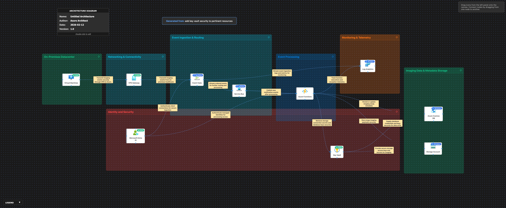

# 🔍 Azure Architecture Validation Report

**Generated:** 2026-02-12, 4:52:17 p.m.

## 🖼️ Architecture Diagram

---

## 📊 Executive Summary

### Overall Score: 74/100

🟡 **Assessment:** The architecture has strong building blocks for secure ingestion and event-driven processing (VPN, Event Hubs/Service Bus, Functions, Key Vault, centralized monitoring). Key gaps are around end-to-end private networking, resiliency/DR posture (zone/region redundancy and backups), and tightening identity/secret patterns (removing key-based access where possible) to meet healthcare-grade security and reliability expectations.

### Pillar Scores at a Glance

| Pillar | Score | Status |
|--------|-------|--------|
| Reliability | 70/100 | ⚠️ Needs Improvement |
| Security | 76/100 | ⚠️ Needs Improvement |
| Cost Optimization | 71/100 | ⚠️ Needs Improvement |
| Operational Excellence | 75/100 | ⚠️ Needs Improvement |
| Performance Efficiency | 78/100 | ⚠️ Needs Improvement |

---

## 🏗️ Detailed Assessment by Pillar

### 1. Reliability (70/100)

🟠 **Disaster Recovery** [HIGH]

**Issue:**  
No explicit multi-region DR strategy is described for event ingestion, processing, and data stores, which risks extended outage or data loss during regional failures.

**Recommendation:**  
Define RTO/RPO per workflow (ingestion, processing, metadata, payload storage). Implement cross-region DR: (1) Event Hubs Geo-DR alias (paired namespace) for ingestion continuity, (2) Service Bus Geo-DR alias for messaging, (3) Cosmos DB multi-region with automatic failover and appropriate consistency, (4) Storage account RA-GZRS (or GZRS+failover plan), (5) Key Vault in paired region with backup/restore runbook. Test failover regularly.

**Affected Resources:**
- Event Hubs
- Service Bus
- Azure Cosmos DB
- Storage Account
- Key Vault
- Azure Functions

---

🟠 **High Availability** [HIGH]

**Issue:**  
Zone redundancy and availability patterns are not specified; single-zone dependencies can reduce availability.

**Recommendation:**  
Enable zone redundancy where supported (Event Hubs, Service Bus Premium, Cosmos DB, Storage, VPN Gateway in active-active where applicable). For Functions, ensure hosting plan and dependencies are zone resilient; consider Premium plan for predictable availability and VNet integration at scale. For VMs, use availability zones or availability sets and load balancing if they are service endpoints.

**Affected Resources:**
- Event Hubs
- Service Bus
- Azure Cosmos DB
- Storage Account
- VPN Gateway
- Azure Functions
- Virtual Machines

---

🟡 **Backups and Data Protection** [MEDIUM]

**Issue:**  
Backup/restore posture for metadata and imaging payloads is not defined; recovery may be incomplete or slow.

**Recommendation:**  
Use Cosmos DB continuous backup (PITR) with defined retention. For Storage, use versioning + soft delete + immutable blob policies (WORM) if required. For VMs, enable Azure Backup and test restores. Document recovery procedures and validate with regular restore drills.

**Affected Resources:**
- Azure Cosmos DB
- Storage Account
- Virtual Machines

---

🟡 **Resilient Messaging** [MEDIUM]

**Issue:**  
Failure handling patterns (retry/backoff, poison messages, dead-letter monitoring) are not described, increasing risk of stuck pipelines or message loss.

**Recommendation:**  
Standardize retry policies, idempotency keys, and dead-letter queue (DLQ) handling. Implement DLQ processing workflows and alerting. Use Service Bus sessions for ordering guarantees where needed; avoid coupling ordering to downstream components.

**Affected Resources:**
- Service Bus
- Azure Functions
- Event Hubs

---

🟢 **Operational Resilience** [LOW]

**Issue:**  
Capacity limits (throughput units, partitions, Function concurrency) are not tied to SLOs, increasing risk of throttling during peaks.

**Recommendation:**  
Load test end-to-end, set capacity targets, and implement autoscale thresholds (Event Hubs throughput/partition planning, Service Bus Premium messaging units if required, Cosmos RU autoscale with alerts on throttling, Function concurrency controls).

**Affected Resources:**
- Event Hubs
- Service Bus
- Azure Functions
- Azure Cosmos DB

---

### 2. Security (76/100)

🟠 **Network Security / Data Exfiltration** [HIGH]

**Issue:**  
Private connectivity is not specified for PaaS resources; public endpoints increase attack surface and exfiltration risk for healthcare data.

**Recommendation:**  
Use Private Endpoints + Private DNS for Event Hubs, Service Bus, Cosmos DB, Storage, Key Vault, and (where applicable) Log Analytics ingestion. Disable public network access on these services. Ensure Functions use VNet integration and route to private endpoints; use NAT Gateway or controlled egress if outbound is required.

**Affected Resources:**
- Event Hubs
- Service Bus
- Azure Cosmos DB
- Storage Account
- Key Vault
- Log Analytics
- Azure Functions

---

🟠 **Identity and Access Management** [HIGH]

**Issue:**  
Key-based access patterns are implied (storage keys, Cosmos keys). Long-lived secrets increase blast radius and rotation burden.

**Recommendation:**  
Prefer Microsoft Entra ID auth and RBAC: (1) Storage: disable shared key access, use managed identity with Storage Blob Data Contributor/Reader as needed; (2) Cosmos DB: use Entra ID RBAC where supported; if keys must be used, store in Key Vault and rotate with automation. Ensure Functions use managed identity only (no embedded secrets).

**Affected Resources:**
- Microsoft Entra ID
- Azure Functions
- Storage Account
- Azure Cosmos DB
- Key Vault

---

🟠 **Key Vault Hardening** [HIGH]

**Issue:**  
Key Vault is present but hardening controls are not stated; misconfiguration can lead to secret exposure or unrecoverable deletion.

**Recommendation:**  
Enable Key Vault soft delete and purge protection, enforce RBAC (or carefully scoped access policies), require private endpoint access, enable logging/diagnostics, and implement automated secret/key rotation. Use separate vaults for environments and consider separate vaults for high-sensitivity keys. Apply least privilege to Function managed identity (get/list only where required).

**Affected Resources:**
- Key Vault
- Azure Functions

---

🟡 **Data Protection / Encryption** [MEDIUM]

**Issue:**  
Customer-managed key (CMK) and immutable retention controls are not specified; may be required for compliance and ransomware resilience.

**Recommendation:**  
Use CMK where appropriate: Storage account encryption with CMK, Cosmos DB CMK (if required), and Event Hubs/Service Bus CMK if compliance mandates. For imaging payloads, enable immutable blob policies and legal hold where needed. Enforce TLS 1.2+ and consider double encryption for highly sensitive data.

**Affected Resources:**
- Key Vault
- Storage Account
- Azure Cosmos DB
- Event Hubs
- Service Bus

---

🟡 **Threat Protection and Posture Management** [MEDIUM]

**Issue:**  
Security monitoring controls (Defender plans, Sentinel integration, alerting) are not described.

**Recommendation:**  
Enable Microsoft Defender for Cloud with relevant plans (Storage, Key Vault, Cosmos DB, App Service/Functions, Resource Manager). Stream security logs to Log Analytics/SIEM, create alert rules for anomalous access, secret retrieval spikes, and public endpoint exposure. Use Azure Policy to enforce private endpoints, disable public access, and require diagnostics.

**Affected Resources:**
- Log Analytics
- Storage Account
- Key Vault
- Azure Cosmos DB
- Azure Functions

---

### 3. Cost Optimization (71/100)

🟠 **Telemetry Cost** [HIGH]

**Issue:**  
High-volume ingestion (events + functions) can generate large Log Analytics costs if not governed (retention, sampling, verbosity).

**Recommendation:**  
Set retention based on compliance needs, use Basic Logs where acceptable, enable sampling for verbose traces, filter noisy categories via diagnostic settings, and create cost alerts/budgets. Consider archiving to Storage for long-term retention instead of long retention in Log Analytics.

**Affected Resources:**
- Log Analytics
- Event Hubs
- Azure Functions

---

🟡 **Right Sizing and Pricing Tiers** [MEDIUM]

**Issue:**  
Messaging tiers and compute plans are not aligned to workload characteristics; overprovisioning or throttling can occur.

**Recommendation:**  
Profile throughput and choose appropriate SKUs: Event Hubs (Standard vs Dedicated), Service Bus (Standard vs Premium), Functions (Consumption vs Premium). Use autoscale for Cosmos DB (RU/s autoscale) and right-size partitioning to reduce RU waste. Periodically review VM sizes and use reserved instances/savings plans where workloads are steady.

**Affected Resources:**
- Event Hubs
- Service Bus
- Azure Functions
- Azure Cosmos DB
- Virtual Machines

---

🟡 **Storage Lifecycle** [MEDIUM]

**Issue:**  
Large imaging payloads can drive significant storage and transaction costs without lifecycle management.

**Recommendation:**  
Implement lifecycle policies to tier blobs (Hot/Cool/Archive) based on access patterns and clinical retention rules. Use compression where appropriate, and prefer block blob uploads with chunking to reduce retries and costs.

**Affected Resources:**
- Storage Account

---

🟢 **Networking Cost** [LOW]

**Issue:**  
VPN Gateway and cross-region/egress traffic costs can be non-trivial at imaging volumes.

**Recommendation:**  
Review throughput requirements; consider ExpressRoute for predictable performance/cost at scale. Minimize egress by keeping processing and storage in-region; use private endpoints to avoid unnecessary NAT/egress paths.

**Affected Resources:**
- VPN Gateway
- Virtual Machines
- Storage Account

---

### 4. Operational Excellence (75/100)

🟠 **Observability and Alerting** [HIGH]

**Issue:**  
Logging is mentioned, but actionable SLO-based alerting and dashboards across the pipeline are not described.

**Recommendation:**  
Define SLOs (ingestion lag, processing latency, DLQ depth, error rate, RU throttles, storage write failures). Implement Azure Monitor alerts and workbooks: Event Hubs incoming messages/lag, Service Bus active/dead-letter counts, Function failures/duration, Cosmos throttling/latency, Key Vault denied requests, storage throttling. Add incident runbooks.

**Affected Resources:**
- Log Analytics
- Event Hubs
- Service Bus
- Azure Functions
- Azure Cosmos DB
- Key Vault
- Storage Account

---

🟡 **Deployment and Configuration Management** [MEDIUM]

**Issue:**  
No Infrastructure as Code (IaC) and environment separation controls are specified; drift and inconsistent security settings are likely.

**Recommendation:**  
Adopt IaC (Bicep/Terraform) and CI/CD with gated approvals. Use separate subscriptions/resource groups per environment, enforce Azure Policy (private endpoints, diagnostics, TLS, disable public access, mandatory tags), and implement configuration validation in pipelines.

**Affected Resources:**
- All services

---

🟡 **Secret and Certificate Operations** [MEDIUM]

**Issue:**  
Secret rotation and certificate lifecycle (if used for VPN or app auth) are not described.

**Recommendation:**  
Automate Key Vault secret rotation (Storage SAS/keys if still used, API secrets), implement certificate rotation schedules, and monitor Key Vault expiration events. Prefer managed identity to reduce secrets.

**Affected Resources:**
- Key Vault
- VPN Gateway
- Azure Functions
- Storage Account
- Azure Cosmos DB

---

🟢 **Operational Readiness** [LOW]

**Issue:**  
Testing practices for resiliency (failover, chaos, load) are not described.

**Recommendation:**  
Add pre-production load tests and resilience tests (forced downstream failure, poison messages, throttling). Schedule DR failover exercises and post-incident reviews with tracked action items.

**Affected Resources:**
- Event Hubs
- Service Bus
- Azure Functions
- Azure Cosmos DB
- Storage Account

---

### 5. Performance Efficiency (78/100)

🟠 **Throughput and Backpressure** [HIGH]

**Issue:**  
Pipeline performance controls are not defined; bursts can overwhelm Functions or downstream stores, causing retries and cascading delays.

**Recommendation:**  
Implement backpressure: control Function concurrency, use batch processing where supported, and decouple payload ingestion from metadata processing. Consider Event Hubs Capture to Storage for burst absorption and replay capability. Use Service Bus sessions/partitioning only where ordering is required; otherwise scale-out via partitions.

**Affected Resources:**
- Event Hubs
- Service Bus
- Azure Functions
- Storage Account

---

🟡 **Cosmos DB Data Modeling** [MEDIUM]

**Issue:**  
Partition key strategy and indexing policies are not described; poor design can cause hot partitions and RU waste.

**Recommendation:**  
Select a partition key that distributes load (e.g., facility/site + time bucket or study identifier with sufficient cardinality). Tune indexing (exclude large fields, use composite indexes for common queries). Monitor RU throttling and latency; use autoscale where appropriate.

**Affected Resources:**
- Azure Cosmos DB

---

🟡 **Function Hosting and Cold Start** [MEDIUM]

**Issue:**  
If Functions run on Consumption with VNet/private endpoints, cold starts and connection management may impact latency.

**Recommendation:**  
For latency-sensitive workloads, consider Functions Premium with pre-warmed instances. Reuse connections (HTTP, Service Bus clients), and use async I/O patterns. Validate end-to-end latency under peak loads.

**Affected Resources:**
- Azure Functions
- Service Bus
- Event Hubs
- Azure Cosmos DB
- Storage Account

---

🟢 **Storage Upload Efficiency** [LOW]

**Issue:**  
Large imaging payload handling approach is not specified; inefficient uploads can cause timeouts and retries.

**Recommendation:**  
Use chunked uploads, parallelism with tuned limits, and consider direct-to-Storage patterns using short-lived SAS tokens minted by a trusted service if appropriate (or managed identity-based flows where feasible). Validate checksum and idempotent writes.

**Affected Resources:**
- Storage Account
- Azure Functions

---

## ⚡ Quick Wins - Immediate Action Items

These are high-impact, low-effort improvements you can implement right away:

### 1. Key Vault Hardening

Enable soft delete + purge protection, turn on diagnostic settings to Log Analytics, and restrict access via RBAC with least privilege.

### 2. Private Networking

Create Private Endpoints for Storage, Cosmos DB, Key Vault, Service Bus, and Event Hubs; disable public network access; configure Private DNS zones and link to VNets used by Functions/VMs.

### 3. Identity

Switch to managed identity + Entra ID RBAC where supported; disable Storage shared key access; remove secrets from app settings and use Key Vault references where needed.

### 4. Monitoring

Add alerts for Service Bus DLQ > 0, Function failure rate, Event Hubs consumer lag, Cosmos RU throttling, and Key Vault denied requests; route to an action group/on-call.

### 5. Data Protection

Enable Storage versioning + soft delete and Cosmos DB continuous backup (PITR). Define and document restore steps.

### 6. Cost Controls

Set Log Analytics retention to the minimum compliant period, enable sampling for high-volume traces, and configure budgets/cost alerts.

---

## 📚 Additional Resources

- [Azure Well-Architected Framework](https://learn.microsoft.com/azure/architecture/framework/)
- [Azure Architecture Center](https://learn.microsoft.com/azure/architecture/)
- [Azure Security Benchmark](https://learn.microsoft.com/security/benchmark/azure/)

---

*Report generated by Azure Architecture Diagram Builder*  
*Powered by GPT-5.2 (medium) and Azure Well-Architected Framework*  
*Generated: 2026-02-12, 4:52:17 p.m.*
