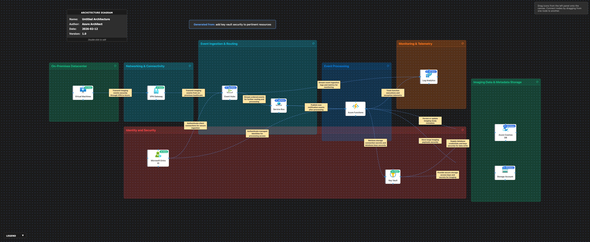

# 🔍 Azure Architecture Validation Report

**Generated:** 2026-02-12, 4:55:01 p.m.

## 🖼️ Architecture Diagram

---

## 📊 Executive Summary

### Overall Score: 74/100

🟡 **Assessment:** The architecture is a solid event-driven pipeline with good use of managed messaging, serverless processing, centralized identity, and telemetry. Key gaps are network isolation (private access), multi-region resiliency/DR, and security hardening for healthcare data (least-privilege, key management, and data exfiltration controls).

### Pillar Scores at a Glance

| Pillar | Score | Status |
|--------|-------|--------|
| Reliability | 68/100 | ⚠️ Needs Improvement |
| Security | 72/100 | ⚠️ Needs Improvement |
| Cost Optimization | 73/100 | ⚠️ Needs Improvement |
| Operational Excellence | 74/100 | ⚠️ Needs Improvement |
| Performance Efficiency | 83/100 | ✅ Good |

---

## 🏗️ Detailed Assessment by Pillar

### 1. Reliability (68/100)

🟠 **Disaster Recovery** [HIGH]

**Issue:**  
No explicit multi-region strategy for Event Hubs, Service Bus, Functions, Cosmos DB, Storage, and Key Vault; regional outage could halt ingestion/processing and risk data loss or prolonged downtime.

**Recommendation:**  
Define RTO/RPO and implement a two-region DR plan: (1) Cosmos DB multi-region writes (or at least multi-region reads + failover) with automated failover, (2) Storage RA-GZRS/GRS plus tested failover and immutable backups where needed, (3) Service Bus Premium with Geo-Disaster Recovery alias, (4) Event Hubs dedicated cluster or Premium with zone redundancy where available and a replay strategy, (5) Functions deployed in both regions with traffic manager/front door (if HTTP) or active-passive trigger enablement, (6) Key Vault paired vault strategy with backup/restore and documented failover.

**Affected Resources:**
- Event Hubs
- Service Bus
- Azure Functions
- Azure Cosmos DB
- Storage Account
- Key Vault

---

🟠 **High Availability** [HIGH]

**Issue:**  
No mention of Availability Zones or zone-redundant configuration; single-zone dependencies increase outage risk.

**Recommendation:**  
Enable zone redundancy where supported: Service Bus Premium zone redundancy, Event Hubs zone redundancy (Premium/Dedicated where applicable), zone-redundant Storage (ZRS), and deploy Functions/VMs with zone-aware architecture. For VMs, use VM Scale Sets or Availability Zones/Availability Sets with load balancing as appropriate.

**Affected Resources:**
- Service Bus
- Event Hubs
- Storage Account
- Azure Functions
- Virtual Machines

---

🟡 **Backpressure & Message Durability** [MEDIUM]

**Issue:**  
The pipeline relies on sequential Event Hubs → Service Bus → Functions with no stated strategy for poison messages, retries, idempotency, and replay; this can cause duplication, stalled processing, or data inconsistency.

**Recommendation:**  
Implement end-to-end resilience patterns: idempotent processing (e.g., Cosmos DB upsert with deterministic keys), dead-letter queues for Service Bus, retry policies with exponential backoff, circuit breakers in Functions, and replay strategy from Event Hubs with checkpointing and versioned processors.

**Affected Resources:**
- Event Hubs
- Service Bus
- Azure Functions
- Azure Cosmos DB

---

🟡 **Capacity & Limits** [MEDIUM]

**Issue:**  
No documented throughput planning (Event Hubs TU/PU, Service Bus messaging units, Cosmos RU/s, Storage ingress/egress) which may lead to throttling and cascading failures under load.

**Recommendation:**  
Perform load modeling and set capacity targets: Event Hubs partition count and throughput units, Service Bus Premium messaging units, Cosmos DB RU/s with autoscale (where suitable) and proper partition keys, and Storage performance tiering. Add throttling handling and alerts tied to 429/ServerBusy metrics.

**Affected Resources:**
- Event Hubs
- Service Bus
- Azure Cosmos DB
- Storage Account
- Azure Functions

---

### 2. Security (72/100)

🟠 **Network Security / Private Access** [HIGH]

**Issue:**  
No mention of Private Endpoints, VNet integration, or disabling public network access. Healthcare imaging payloads and metadata traversing public endpoints increases exposure and complicates compliance.

**Recommendation:**  
Adopt a private-by-default posture: enable Private Endpoints for Event Hubs, Service Bus, Cosmos DB, Storage, Key Vault, and Log Analytics (where feasible); disable public network access; integrate Functions with VNet (Premium/ASE as required) and use Private DNS zones. Restrict access via NSGs/UDRs and enforce egress control (Azure Firewall) for Functions/VMs.

**Affected Resources:**
- Event Hubs
- Service Bus
- Azure Cosmos DB
- Storage Account
- Key Vault
- Log Analytics
- Azure Functions
- Virtual Machines

---

🟠 **Identity & Secrets** [HIGH]

**Issue:**  
Key Vault is used, but the design still references storage connection secrets and database keys. Long-lived keys and connection strings increase blast radius and rotation burden.

**Recommendation:**  
Prefer Microsoft Entra ID authentication over shared keys: use managed identities for Functions/VMs, use RBAC for Storage (Azure AD auth) and Cosmos DB (Entra ID/RBAC where supported), and avoid account keys/connection strings. If keys must exist, store only in Key Vault, rotate automatically, and use Key Vault references where supported.

**Affected Resources:**
- Microsoft Entra ID
- Azure Functions
- Virtual Machines
- Key Vault
- Storage Account
- Azure Cosmos DB

---

🟠 **Data Protection / Compliance** [HIGH]

**Issue:**  
No explicit controls for encryption key ownership (CMK), immutability, retention, and auditing appropriate for healthcare workloads (e.g., HIPAA/HITRUST).

**Recommendation:**  
Enable encryption-at-rest with customer-managed keys (CMK) for Storage, Cosmos DB, Event Hubs/Service Bus where supported. For imaging payloads, enable Storage immutability (WORM) where required, versioning, soft delete, and access logging. Ensure auditing (Key Vault logging, data plane logs) and align retention to compliance requirements.

**Affected Resources:**
- Storage Account
- Azure Cosmos DB
- Event Hubs
- Service Bus
- Key Vault
- Log Analytics

---

🟡 **Key Vault Hardening** [MEDIUM]

**Issue:**  
Key Vault protections are not specified; misconfiguration can lead to secret exfiltration or accidental deletion.

**Recommendation:**  
Harden Key Vault: enable soft-delete and purge protection, disable public access (use Private Endpoint), enforce RBAC or tightly-scoped access policies, enable firewall restrictions, enable diagnostic logs to Log Analytics, and implement rotation policies with alerts for nearing expiration.

**Affected Resources:**
- Key Vault
- Log Analytics
- Microsoft Entra ID

---

🟡 **Messaging Security** [MEDIUM]

**Issue:**  
Authorization model for Event Hubs/Service Bus is not defined (RBAC vs SAS), and there is no mention of TLS enforcement and minimum versions.

**Recommendation:**  
Use Entra ID RBAC for Event Hubs/Service Bus and disable/limit SAS policies where possible. Enforce TLS 1.2+, validate client auth, and restrict network paths with private endpoints and firewall rules.

**Affected Resources:**
- Event Hubs
- Service Bus
- Microsoft Entra ID

---

### 3. Cost Optimization (73/100)

🟡 **Service Tier Selection** [MEDIUM]

**Issue:**  
No workload-based sizing is stated for Event Hubs, Service Bus, Cosmos DB RU/s, and Functions hosting; risk of overprovisioning or unintended throttling-driven waste.

**Recommendation:**  
Baseline throughput and pick tiers intentionally: Event Hubs Standard vs Premium/Dedicated based on throughput/isolation; Service Bus Standard vs Premium (consider Premium for predictable latency/zone redundancy); Cosmos DB autoscale for variable workloads; Functions Consumption/Premium based on VNet/private endpoint needs and execution patterns.

**Affected Resources:**
- Event Hubs
- Service Bus
- Azure Cosmos DB
- Azure Functions

---

🟡 **Storage Cost Management** [MEDIUM]

**Issue:**  
Large imaging payloads can drive significant storage and egress costs without lifecycle governance.

**Recommendation:**  
Implement Storage lifecycle policies: hot → cool → archive transitions, retention-based deletion, and consider compression where applicable. Minimize cross-region and internet egress by keeping processing and storage co-located and using private networking.

**Affected Resources:**
- Storage Account
- Azure Functions

---

🟡 **Logging & Retention** [MEDIUM]

**Issue:**  
Log Analytics ingestion and retention costs can grow quickly with verbose telemetry from Functions and streaming ingestion logs.

**Recommendation:**  
Define a telemetry strategy: tune sampling, reduce verbose logs, use table-level retention policies, archive to Storage for long-term retention, and set budget alerts. Prefer metrics over logs where possible for high-volume signals.

**Affected Resources:**
- Log Analytics
- Azure Functions
- Event Hubs

---

🟢 **Reserved Capacity/Commitments** [LOW]

**Issue:**  
No mention of commitments (Savings Plans/Reserved Instances) for steady-state compute and data services.

**Recommendation:**  
For predictable usage, evaluate Savings Plans for Compute (VMs) and reserved capacity/commitments for Cosmos DB and other eligible services; schedule non-production environments and shut down when idle.

**Affected Resources:**
- Virtual Machines
- Azure Cosmos DB

---

### 4. Operational Excellence (74/100)

🟠 **Observability & Alerting** [HIGH]

**Issue:**  
Telemetry sources are listed, but there is no end-to-end operational model: alert rules, dashboards, SLOs, runbooks, and incident response are unspecified.

**Recommendation:**  
Implement SRE-style operations: define SLOs (ingestion lag, processing latency, failure rate), create Azure Monitor alerts (Event Hubs throttling, Service Bus DLQ depth, Function failures, Cosmos 429s, Storage availability), build workbooks/dashboards, and attach runbooks/automation for common incidents.

**Affected Resources:**
- Log Analytics
- Event Hubs
- Service Bus
- Azure Functions
- Azure Cosmos DB
- Storage Account

---

🟡 **Infrastructure as Code & Configuration Drift** [MEDIUM]

**Issue:**  
No mention of IaC, policy enforcement, or standardized deployment approach across environments.

**Recommendation:**  
Use IaC (Bicep/Terraform) for all resources, enforce Azure Policy initiatives (private endpoints, diagnostic settings, TLS, public access disabled), and implement CI/CD with environment promotion, approvals, and automated validation.

**Affected Resources:**
- VPN Gateway
- Event Hubs
- Service Bus
- Azure Functions
- Azure Cosmos DB
- Storage Account
- Log Analytics
- Key Vault
- Virtual Machines

---

🟡 **Secrets/Certificate Lifecycle** [MEDIUM]

**Issue:**  
Key Vault is present, but secret rotation, certificate renewal, and access review processes are not described.

**Recommendation:**  
Automate secret rotation (where keys remain necessary), set expiration and renewal alerts, use managed identities and Key Vault RBAC, and run periodic access reviews (Entra ID) and Key Vault access audits.

**Affected Resources:**
- Key Vault
- Microsoft Entra ID
- Azure Functions
- Virtual Machines

---

🟢 **Change Management** [LOW]

**Issue:**  
No safe deployment practices are specified for Functions and message processors (e.g., canary releases, backward-compatible schema evolution).

**Recommendation:**  
Adopt safe release patterns: version event schemas, use canary/slot deployments for Functions, and implement consumer-driven contract testing for event payloads.

**Affected Resources:**
- Azure Functions
- Event Hubs
- Service Bus

---

### 5. Performance Efficiency (83/100)

🟡 **Event Streaming Design** [MEDIUM]

**Issue:**  
Event Hubs → Service Bus chaining can add latency and complexity if not justified; ordered delivery requirements and partitioning strategy are not specified.

**Recommendation:**  
Validate the need for both brokers. If required, document responsibilities (Event Hubs for ingestion/telemetry-scale streaming; Service Bus for commands/work queues). Define partition key strategy for ordering (e.g., by study/patient ID where appropriate) and ensure Functions scale settings align with partitions and queue concurrency.

**Affected Resources:**
- Event Hubs
- Service Bus
- Azure Functions

---

🟡 **Cosmos DB Data Modeling** [MEDIUM]

**Issue:**  
Partitioning and indexing strategy for imaging metadata is not described; poor partitioning can cause hot partitions and RU inefficiency.

**Recommendation:**  
Choose a partition key aligned to access patterns and scale (e.g., tenant/facility + time bucket, or study ID depending on queries). Tune indexing (exclude large unused paths), use bulk execution where applicable, and add caching/read replicas only if needed.

**Affected Resources:**
- Azure Cosmos DB
- Azure Functions

---

🟢 **Cold Start & Network Path** [LOW]

**Issue:**  
If Functions use VNet integration/private endpoints, cold starts and DNS resolution can add latency without tuning.

**Recommendation:**  
If low latency is required, prefer Functions Premium with pre-warmed instances; tune concurrency, use async I/O, and ensure Private DNS zones are correctly linked to VNets to avoid resolution delays/timeouts.

**Affected Resources:**
- Azure Functions
- Key Vault
- Storage Account
- Azure Cosmos DB

---

🟢 **VM Workloads** [LOW]

**Issue:**  
VM role is not clear (e.g., imaging preprocessing), and performance characteristics (GPU, disk throughput) are not addressed.

**Recommendation:**  
If VMs handle compute-heavy imaging tasks, right-size with appropriate SKUs (GPU if needed), use Premium SSD v2/Ultra Disk where required, and implement autoscaling with VM Scale Sets. Prefer managed services where possible to reduce operational overhead.

**Affected Resources:**
- Virtual Machines

---

## ⚡ Quick Wins - Immediate Action Items

These are high-impact, low-effort improvements you can implement right away:

### 1. Security / Key Vault

Enable Key Vault soft-delete and purge protection, turn on diagnostic settings to Log Analytics, and restrict access with RBAC least-privilege (remove broad contributor/owner access).

### 2. Security / Public Exposure

Start by disabling public network access (where feasible) and adding Private Endpoints for Storage and Key Vault first (highest data sensitivity), then extend to Cosmos DB, Service Bus, and Event Hubs.

### 3. Operational Excellence / Alerting

Create core alerts: Service Bus DLQ message count, Function failures/exceptions, Cosmos DB 429 rate, Storage availability, Event Hubs throttled requests, and Key Vault denied requests; route to an action group.

### 4. Reliability / Message Handling

Enable and monitor Service Bus DLQ, implement idempotency in Functions, and standardize retry/backoff policies to prevent runaway retries and duplicate writes.

### 5. Cost Optimization / Logging

Reduce high-volume logs with sampling and set Log Analytics retention per table; archive long-term logs to Storage.

---

## 📚 Additional Resources

- [Azure Well-Architected Framework](https://learn.microsoft.com/azure/architecture/framework/)
- [Azure Architecture Center](https://learn.microsoft.com/azure/architecture/)
- [Azure Security Benchmark](https://learn.microsoft.com/security/benchmark/azure/)

---

*Report generated by Azure Architecture Diagram Builder*  
*Powered by GPT-5.2 (medium) and Azure Well-Architected Framework*  
*Generated: 2026-02-12, 4:55:01 p.m.*
