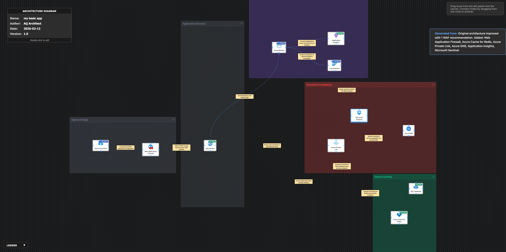

# 🔍 Azure Architecture Validation Report

**Generated:** 2026-02-13, 8:44:22 a.m.

## 🖼️ Architecture Diagram

---

## 📊 Executive Summary

### Overall Score: 82/100

🟢 **Assessment:** The architecture demonstrates strong security posture with modern ingress, monitoring, and private connectivity patterns. There are minor gaps in resilience, disaster recovery, and cost optimization. Proactive monitoring and SIEM are well-established, but opportunities exist for improvement in high availability, scaling, and cost management.

### Pillar Scores at a Glance

| Pillar | Score | Status |
|--------|-------|--------|
| Reliability | 78/100 | ⚠️ Needs Improvement |
| Security | 87/100 | ✅ Good |
| Cost Optimization | 76/100 | ⚠️ Needs Improvement |
| Operational Excellence | 86/100 | ✅ Good |
| Performance Efficiency | 82/100 | ✅ Good |

---

## 🏗️ Detailed Assessment by Pillar

### 1. Reliability (78/100)

🟠 **Disaster Recovery** [HIGH]

**Issue:**  
Single-region deployment with no clear cross-region failover or DR plan.

**Recommendation:**  
Implement geo-replication and cross-region DR for App Service and SQL Database; use Traffic Manager with Azure Front Door for global failover.

**Affected Resources:**
- Azure Front Door
- App Service
- SQL Database

---

🟡 **Availability** [MEDIUM]

**Issue:**  
App Service is not explicitly configured with deployment slots or scaled across multiple Availability Zones.

**Recommendation:**  
Configure App Service with deployment slots and scale-out across multiple zones to improve resilience.

**Affected Resources:**
- App Service

---

🟡 **Cache Reliability** [MEDIUM]

**Issue:**  
Azure Cache for Redis may not be on Premium tier with Zone Redundancy enabled.

**Recommendation:**  
Upgrade Azure Cache for Redis to Premium with Geo-Replication or Zone Redundancy as appropriate.

**Affected Resources:**
- Azure Cache for Redis

---

### 2. Security (87/100)

🟡 **Secrets Management** [MEDIUM]

**Issue:**  
Managed identities, Key Vault integration or secure secret rotation not mentioned.

**Recommendation:**  
Implement Azure Managed Identities and Azure Key Vault for all application secrets and connection strings.

**Affected Resources:**
- App Service
- SQL Database
- Azure Cache for Redis

---

🟢 **WAF Policy** [LOW]

**Issue:**  
No periodic review process for WAF managed rule sets or custom policies.

**Recommendation:**  
Establish regular security reviews of Web Application Firewall policies.

**Affected Resources:**
- Web Application Firewall

---

### 3. Cost Optimization (76/100)

🟡 **Right-Sizing** [MEDIUM]

**Issue:**  
No evidence of cost governance or sizing review for App Service, SQL Database, or Azure Cache for Redis.

**Recommendation:**  
Review and adjust pricing tiers or instance sizes based on regular utilization reports.

**Affected Resources:**
- App Service
- SQL Database
- Azure Cache for Redis

---

🟡 **Reserved Instances** [MEDIUM]

**Issue:**  
No mention of reserved instance or savings plans for predictable workloads.

**Recommendation:**  
Evaluate and commit to Reserved Instances/Savings Plans where capacity is predictable.

**Affected Resources:**
- App Service
- SQL Database
- Azure Cache for Redis

---

### 4. Operational Excellence (86/100)

🟡 **Automation** [MEDIUM]

**Issue:**  
Lack of explicit CI/CD, deployment automation, or IaC references.

**Recommendation:**  
Automate deployments using Azure DevOps or GitHub Actions; manage resources with ARM/Bicep/Terraform.

**Affected Resources:**
- App Service
- Azure Front Door
- Web Application Firewall
- SQL Database
- Azure Cache for Redis

---

### 5. Performance Efficiency (82/100)

🟡 **App Service Scaling** [MEDIUM]

**Issue:**  
No auto-scale rules or configuration details for App Service; risk of over/under-provisioning.

**Recommendation:**  
Enable and tune autoscale for App Service based on workload metrics.

**Affected Resources:**
- App Service

---

🟡 **SQL Performance** [MEDIUM]

**Issue:**  
No mention of SQL elastic pools or indexing for query optimization.

**Recommendation:**  
If workload fluctuates, use SQL elastic pools; evaluate SQL Database with Automatic Tuning and Index Advisor.

**Affected Resources:**
- SQL Database

---

## ⚡ Quick Wins - Immediate Action Items

These are high-impact, low-effort improvements you can implement right away:

### 1. Cost Optimization

Set up Azure Cost Management budgets and alerts to monitor and control spending.

### 2. Security

Configure Azure Key Vault and migrate credentials from configuration files immediately.

### 3. Reliability

Enable at least one deployment slot for safe blue/green or canary deployments.

---

## 📚 Additional Resources

- [Azure Well-Architected Framework](https://learn.microsoft.com/azure/architecture/framework/)
- [Azure Architecture Center](https://learn.microsoft.com/azure/architecture/)
- [Azure Security Benchmark](https://learn.microsoft.com/security/benchmark/azure/)

---

*Report generated by Azure Architecture Diagram Builder*  
*Powered by GPT-4.1 and Azure Well-Architected Framework*  
*Generated: 2026-02-13, 8:44:22 a.m.*
