# Azure Architecture Diagram Builder - System Architecture

**Last Updated**: February 12, 2026

## Overview

The Azure Architecture Diagram Builder is a web-based tool that uses AI to generate Azure architecture diagrams with real-time pricing estimates. Built with React, TypeScript, and Vite, it leverages Azure OpenAI (GPT-5.2, GPT-4.1, GPT-4.1 Mini) for intelligent diagram generation and the Azure Retail Prices API for cost estimation. A lightweight Express.js backend (port 8787) supports version storage and server-side operations.

## High-Level Architecture

```mermaid
graph TB
    subgraph "Frontend Layer"
        UI[React UI Components]
        RF[React Flow Canvas]
        State[React State Management]
    end
    
    subgraph "Service Layer"
        AI[Azure OpenAI Service]
        Pricing[Cost Estimation Service]
        Regional[Regional Pricing Service]
        Icons[Icon Loader]
        Validator[Architecture Validator]
        DeployGen[Deployment Guide Generator]
    end
    
    subgraph "State Management"
        ModelStore[Model Settings Store<br/>GPT-5.2 / GPT-4.1 / GPT-4.1 Mini]
    end
    
    subgraph "Data Layer"
        PricingData[(Pricing JSON Files<br/>47 services × 5 regions)]
        IconData[(SVG Icons<br/>713 files in 29 categories)]
        Mappings[Service Mappings<br/>& Icon Mappings]
    end
    
    subgraph "Backend Layer"
        Server[Express.js Server<br/>Port 8787]
    end
    
    subgraph "External APIs"
        OpenAI[Azure OpenAI API<br/>GPT-5.2 / GPT-4.1 / GPT-4.1 Mini]
        AzureAPI[Azure Retail Prices API]
    end
    
    UI --> RF
    UI --> State
    State --> ModelStore
    State --> AI
    State --> Pricing
    State --> Icons
    AI --> OpenAI
    ModelStore --> AI
    Pricing --> Regional
    Regional --> PricingData
    Icons --> IconData
    Pricing --> Mappings
    Validator --> OpenAI
    DeployGen --> OpenAI
    State --> Server
```



## Detailed Component Architecture


## Data Flow - Diagram Generation


## Data Flow - Region Change


## File Structure

```
azure-diagrams/
├── src/
│   ├── components/                    # React UI components (16 components)
│   │   ├── AIArchitectureGenerator.tsx # AI generation modal with model selection (328 lines)
│   │   ├── AlignmentToolbar.tsx       # Node alignment tools (103 lines)
│   │   ├── AzureNode.tsx              # Service node with pricing badge (264 lines)
│   │   ├── DeploymentGuideModal.tsx    # Deployment guide & Bicep output (338 lines)
│   │   ├── EditableEdge.tsx           # Connection lines with labels (225 lines)
│   │   ├── GroupNode.tsx              # Container groups (191 lines)
│   │   ├── IconPalette.tsx            # Drag-and-drop icon palette (150 lines)
│   │   ├── ImageUploader.tsx          # Image upload for diagrams (180 lines)
│   │   ├── Legend.tsx                 # Diagram legend (186 lines)
│   │   ├── ModelSelector.tsx          # Model/reasoning dropdown (343 lines)
│   │   ├── RegionSelector.tsx         # Region picker (64 lines)
│   │   ├── SaveSnapshotModal.tsx      # Save snapshots (118 lines)
│   │   ├── TitleBlock.tsx             # Architecture title block (155 lines)
│   │   ├── ValidationModal.tsx        # Architecture validation UI (317 lines)
│   │   ├── VersionHistoryModal.tsx    # Version comparison UI (269 lines)
│   │   └── WorkflowPanel.tsx          # Workflow steps panel (68 lines)
│   │
│   ├── services/                      # Business logic layer
│   │   ├── azureOpenAI.ts             # AI diagram generation (558 lines)
│   │   ├── architectureValidator.ts   # Architecture review & validation (334 lines)
│   │   ├── costEstimationService.ts   # Pricing calculations (401 lines)
│   │   ├── deploymentGuideGenerator.ts # Deployment guides & Bicep (396 lines)
│   │   ├── drawioExporter.ts          # Draw.io XML export (414 lines)
│   │   ├── azurePricingService.ts     # Azure API integration
│   │   ├── localPricingService.ts     # Local pricing fallback (73 lines)
│   │   ├── regionalPricingService.ts  # Multi-region pricing (352 lines)
│   │   └── versionStorageService.ts   # Version history persistence (177 lines)
│   │
│   ├── stores/                        # State management
│   │   └── modelSettingsStore.ts      # Multi-model settings with localStorage (271 lines)
│   │
│   ├── data/
│   │   ├── pricing/
│   │   │   └── regions/
│   │   │       ├── eastus2/           # 47 JSON files
│   │   │       ├── swedencentral/     # 47 JSON files
│   │   │       ├── westeurope/        # 47 JSON files
│   │   │       ├── brazilsouth/       # 47 JSON files
│   │   │       └── canadacentral/     # 47 JSON files
│   │   ├── azurePricing.ts            # Service mappings & fallback pricing (1,059 lines)
│   │   └── serviceIconMapping.ts      # AI name → icon path mapping (812 lines)
│   │
│   ├── utils/
│   │   ├── iconLoader.ts              # Icon matching & loading (113 lines)
│   │   ├── layoutEngine.ts            # Auto-layout algorithm (258 lines)
│   │   ├── layoutPresets.ts           # Layout preset configurations (460 lines)
│   │   ├── modelNaming.ts             # Model display name utilities (76 lines)
│   │   └── pricingHelpers.ts          # Currency formatting (330 lines)
│   │
│   ├── types/
│   │   └── pricing.ts                 # TypeScript interfaces
│   │
│   └── App.tsx                        # Main application (2,619 lines)
│
├── server/                            # Express.js backend (port 8787)
│   ├── index.js                       # Server entry point (113 lines)
│   └── store.js                       # Data persistence (174 lines)
│
├── Azure_Public_Service_Icons/        # 713 SVG files in 29 categories
├── scripts/                           # Utility scripts
│   ├── fetch-multi-region-pricing.sh  # Download pricing data
│   ├── download-pricing.js            # Node.js pricing fetcher
│   ├── rename-icons.sh               # Icon file management
│   └── deploy.sh                      # Deployment script
├── DOCS/                              # Documentation
│   └── ARCHITECTURE.md                # This file
├── Dockerfile                         # Container build
└── nginx.conf                         # Production serving
```

## Key Technologies

### Frontend Stack
- **React 18.2** - UI framework
- **TypeScript 5.2** - Type safety
- **Vite 5.0** - Build tool & dev server (port 3000)
- **React Flow 11.10.4** - Interactive diagram canvas
- **html2canvas 1.4.1** - Diagram export to PNG

### Backend Stack
- **Express.js** - Server on port 8787
- **Node.js** - Runtime for server and scripts

### AI Models (via Azure OpenAI)
- **GPT-5.2** - Reasoning model with configurable effort (none/low/medium/high), 16,000 max tokens
- **GPT-4.1** - Non-reasoning model, 10,000 max tokens
- **GPT-4.1 Mini** - Lightweight non-reasoning model, 8,000 max tokens
- Selectable per-generation via **ModelSelector** dropdown
- Per-feature overrides stored in localStorage

### Services & APIs
- **Azure OpenAI API** (`2025-04-01-preview`) - AI-powered diagram generation, validation, deployment guides
- **Azure Retail Prices API** - Real-time pricing data
- **Vite Dynamic Imports** - SVG icon loading (`import.meta.glob`)

### Data Management
- **JSON files** - Cached regional pricing (235 files total: 47 services × 5 regions)
- **SVG files** - Azure service icons (713 files)
- **In-memory caching** - Performance optimization
- **localStorage** - Model settings, per-feature overrides, version history

## Core Features

### 1. AI-Powered Diagram Generation
- **Input**: Natural language architecture description
- **Model Selection**: Choose GPT-5.2 (with reasoning effort), GPT-4.1, or GPT-4.1 Mini via dropdown
- **Processing**: Azure OpenAI analyzes requirements and generates structured JSON
- **Output**: Services, connections (sync/async/optional/bidirectional), groups, and workflow steps
- **Model Override**: Settings captured at click time from `useModelSettings()` hook and passed explicitly to API

### 2. Icon Matching System
- **Challenge**: Map AI-generated service names to 713 icon files
- **Solution**: 
  - Renamed icons from `10042-icon-service-API-Management.svg` to `api-management.svg`
  - Service icon mapping file (812 lines) maps AI names directly to icon paths
  - Title Case conversion with acronym preservation (AI, SQL, CDN, API, etc.)
  - Multi-stage matching: exact → multi-word → primary word → fallback
  - Service name normalization mappings (1,059 lines)

### 3. Regional Pricing Engine
- **5 regions supported**: East US 2, Sweden Central, West Europe, Brazil South, Canada Central
- **47 services per region**: 235 total pricing files
- **Dynamic loading**: Pricing fetched on-demand per service/region
- **Caching**: Two-level cache (raw data + parsed pricing)
- **Fallback system**: Usage-based services use estimated costs

### 4. Cost Estimation
- **Real-time calculation**: Updates on region change
- **Tier-based pricing**: Multiple SKUs per service (Basic, Standard, Premium)
- **Monthly estimates**: Converts hourly/usage-based to monthly
- **Cost breakdown**: Total, per-group, per-service analysis
- **Color-coded badges**:
  - Green: Free or < $100/month
  - Yellow: $100-500/month
  - Orange: $500-1000/month
  - Red: > $1000/month

### 5. Export Capabilities
- **PNG Export**: High-quality 2x scale diagram images
- **SVG Export**: Vector graphics for editing
- **JSON Export**: Diagram structure for re-import
- **Draw.io Export**: XML format for Draw.io/diagrams.net editing
- **ARM Template**: Azure deployment ready (partial)
- **CSV/JSON Cost Reports**: Detailed cost breakdowns

### 6. Architecture Validation
- **AI-powered review**: Validates architecture against best practices
- **Checks**: Security, scalability, resilience, cost optimization
- **Output**: Scored assessment with actionable recommendations

### 7. Deployment Guide Generation
- **Bicep templates**: Infrastructure-as-Code generation from diagrams
- **Step-by-step guides**: Deployment instructions per service
- **Prerequisites**: Lists required Azure permissions and tools

### 8. Version History
- **Auto-save**: Snapshots saved on significant changes
- **Manual save**: Named snapshots with descriptions
- **Comparison**: Side-by-side version diff
- **Restore**: Roll back to any previous version

### 9. Model Selection & Comparison
- **Multi-model support**: Switch between GPT-5.2, GPT-4.1, GPT-4.1 Mini
- **Reasoning effort**: Configurable for GPT-5.2 (none/low/medium/high)
- **Per-feature overrides**: Different models for generation vs. validation vs. deployment guides
- **Model comparison outputs**: Side-by-side architecture quality comparison

## Service Name Mapping Strategy

The app uses a three-layer mapping system to handle service name variations:

```typescript
// Layer 1: AI-generated name → Azure service name
'Api Management' → 'API Management'
'Azure Cosmos Db' → 'Azure Cosmos DB'

// Layer 2: Azure service name → Pricing file
'API Management' → 'api_management.json'
'Azure Cosmos DB' → 'azure_cosmos_db.json'

// Layer 3: Azure service name → Icon file
'API Management' → 'api-management.svg' → Title Case → 'API Management'
'Azure Cosmos DB' → 'azure-cosmos-db.svg' → Title Case → 'Azure Cosmos DB'
```

## Performance Optimizations

1. **Icon Preloading**: Loads all 713 icons on app mount (async)
2. **Pricing Cache**: Two-level cache (raw JSON + parsed tiers)
3. **Lazy Loading**: Pricing data fetched only for used services
4. **Parallel Processing**: Icons and pricing load simultaneously
5. **Debounced Updates**: Region changes trigger single batch update
6. **Vite HMR**: Fast refresh during development
7. **Model Settings Persistence**: localStorage avoids re-configuration between sessions

## Regional Pricing Data

### Fetching Script
```bash
scripts/fetch-multi-region-pricing.sh
```
- Fetches from Azure Retail Prices API
- Filters by region and service name
- Stores in `src/data/pricing/regions/{region}/{service}.json`
- 47 services × 5 regions = 235 files (~116KB each)

### Pricing Data Structure
```json
{
  "BillingCurrency": "USD",
  "Items": [
    {
      "serviceName": "API Management",
      "skuName": "Developer",
      "armRegionName": "eastus2",
      "retailPrice": 0.0616,
      "unitOfMeasure": "1 Hour",
      "type": "Consumption"
    }
  ]
}
```

## Critical Implementation Details

### Icon Matching Flow (App.tsx:466-530)
1. Load icons from category using `loadIconsFromCategory()`
2. Try exact name match (case-insensitive)
3. Try multi-word match (all significant words)
4. Try primary word match (first non-common word)
5. Use fallback icon from category
6. Cache icon path in `iconCache` Map

### Pricing Initialization (costEstimationService.ts:34-115)
1. Check if service has pricing data
2. Map AI name to Azure service name
3. Get default tier (Basic, Standard, Premium)
4. Fetch regional pricing from JSON files
5. Parse tiers and find best match
6. Calculate monthly cost from hourly/usage rates
7. Apply regional multiplier if needed
8. Return `NodePricingConfig` object

### AI Prompt Structure (azureOpenAI.ts:130-200)
- **Category mappings**: Guide AI to use correct categories
- **Critical icon mappings**: Exact service names that match icons
- **Rules**: 11 numbered rules for structure and naming
- **Examples**: Correct vs incorrect naming patterns
- **Service-specific guidance**: Microsoft Entra ID (not Azure AD)

## Environment Variables

```env
VITE_AZURE_OPENAI_ENDPOINT=<Azure OpenAI endpoint URL>
VITE_AZURE_OPENAI_API_KEY=<API key>
VITE_AZURE_OPENAI_DEPLOYMENT=<Default deployment name>
VITE_AZURE_OPENAI_DEPLOYMENT_GPT52=<GPT-5.2 deployment>
VITE_AZURE_OPENAI_DEPLOYMENT_GPT41=<GPT-4.1 deployment>
VITE_AZURE_OPENAI_DEPLOYMENT_GPT41MINI=<GPT-4.1 Mini deployment>
VITE_REASONING_EFFORT=<medium|low|high|none>
```

## Known Limitations

1. **Icon Coverage**: Not all Azure services have custom icons (fallbacks used)
2. **Pricing Accuracy**: Estimates based on default tiers and typical usage
3. **Usage-Based Services**: Fixed fallback estimates (e.g., Storage, Monitor)
4. **Region Coverage**: 5 regions (can expand to 60+ Azure regions)
5. **ARM Export**: Partial implementation, not production-ready
6. **GPT-4.1 Mini**: May occasionally misidentify services (e.g., wrong service labels)

## Future Enhancements

1. **Custom Usage Estimates**: Allow users to input expected usage (GB, transactions, etc.)
2. **More Regions**: Expand to all Azure regions
3. **Real-time API Pricing**: Fetch latest prices on-demand (vs. cached)
4. **Cost Alerts**: Notify when estimated cost exceeds threshold
5. **Collaborative Editing**: Multi-user diagram editing
6. **Template Library**: Pre-built reference architectures

## Development Workflow

### Adding a New Service

1. **Fetch pricing data**:
   ```bash
   # Add to scripts/fetch-multi-region-pricing.sh
   SERVICES=("New Service Name")
   bash scripts/fetch-multi-region-pricing.sh
   ```

2. **Add service mapping** in `src/data/azurePricing.ts`:
   ```typescript
   SERVICE_NAME_MAPPING = {
     'New Service': 'Azure New Service',
   }
   DEFAULT_TIERS = {
     'Azure New Service': 'Standard',
   }
   FALLBACK_PRICING = {
     'Azure New Service': { standard: 10.00, ... },
   }
   ```

3. **Get/rename icon** in `Azure_Public_Service_Icons/`:
   - Find matching icon
   - Rename to `new-service.svg`
   - Place in appropriate category folder

4. **Test**:
   - Generate diagram with new service
   - Verify icon loads
   - Verify pricing badge appears

### Debugging Tips

1. **Icon not loading**: Check browser console for file path
2. **Pricing not showing**: Check `💰 Initializing pricing` logs
3. **Wrong pricing**: Verify service name mapping
4. **Vite cache issues**: `rm -rf node_modules/.vite && npm run dev`

## Conclusion

The Azure Architecture Diagram Builder demonstrates a sophisticated integration of AI, real-time pricing data, and dynamic UI rendering to create an intelligent architecture design tool. The modular architecture separates concerns effectively, enabling easy maintenance and feature additions.

Key architectural decisions:
- **Multi-model AI support** with reactive model selection via `useModelSettings()` hook
- **File-based pricing cache** for reliability and performance across 5 regions
- **Multi-stage icon matching** for flexible service name handling (812-line mapping + 1,059-line normalization)
- **Layered service mappings** to bridge AI outputs with Azure reality
- **React Flow canvas** for professional diagram rendering
- **Architecture validation and deployment guide generation** as AI-powered features
- **Express.js backend** for version persistence and server-side operations

The system successfully handles the complexity of 713 icons, 235 pricing files, 3 AI models, and variable service naming conventions to deliver a seamless user experience.
