# Azure Architecture Diagram Builder - System Architecture

## Overview

The Azure Architecture Diagram Builder is a web-based tool that uses AI to generate Azure architecture diagrams with real-time pricing estimates. Built with React, TypeScript, and Vite, it leverages Azure OpenAI for intelligent diagram generation and the Azure Retail Prices API for cost estimation.

## High-Level Architecture

```mermaid
graph TB
    subgraph "Frontend Layer"
        UI[React UI Components]
        RF[React Flow Canvas]
        State[React State Management]
    end
    
    subgraph "Service Layer"
        AI[Azure OpenAI Service]
        Pricing[Cost Estimation Service]
        Regional[Regional Pricing Service]
        Icons[Icon Loader]
        RefArch[Reference Architecture Service]
    end
    
    subgraph "Data Layer"
        PricingData[(Pricing JSON Files<br/>48 services × 3 regions)]
        IconData[(SVG Icons<br/>705 files in 29 categories)]
        Mappings[Service Mappings<br/>& Fallback Pricing]
    end
    
    subgraph "External APIs"
        OpenAI[Azure OpenAI API<br/>GPT-4o]
        AzureAPI[Azure Retail Prices API]
    end
    
    UI --> RF
    UI --> State
    State --> AI
    State --> Pricing
    State --> Icons
    AI --> OpenAI
    Pricing --> Regional
    Regional --> PricingData
    Icons --> IconData
    Pricing --> Mappings
    RefArch --> AI
```



## Detailed Component Architecture


## Data Flow - Diagram Generation


## Data Flow - Region Change


## File Structure

```
azure-diagrams/
├── src/
│   ├── components/          # React UI components
│   │   ├── AzureNode.tsx   # Service node with pricing badge
│   │   ├── EditableEdge.tsx # Connection lines
│   │   ├── GroupNode.tsx   # Container groups
│   │   └── RegionSelector.tsx # Region picker
│   │
│   ├── services/           # Business logic layer
│   │   ├── azureOpenAI.ts  # AI diagram generation (416 lines)
│   │   ├── costEstimationService.ts # Pricing calculations (407 lines)
│   │   ├── regionalPricingService.ts # Multi-region pricing (349 lines)
│   │   ├── azurePricingService.ts # Azure API integration
│   │   ├── iconLoader.ts   # SVG icon loading
│   │   └── referenceArchitectureService.ts # Templates
│   │
│   ├── data/
│   │   ├── pricing/
│   │   │   └── regions/
│   │   │       ├── eastus2/    # 48 JSON files
│   │   │       ├── swedencentral/ # 48 JSON files
│   │   │       └── westeurope/ # 48 JSON files
│   │   └── azurePricing.ts # Service mappings (706 lines)
│   │
│   ├── utils/
│   │   ├── iconLoader.ts   # Icon matching & loading
│   │   └── pricingHelpers.ts # Currency formatting
│   │
│   ├── types/
│   │   └── pricing.ts      # TypeScript interfaces
│   │
│   └── App.tsx            # Main application (1122 lines)
│
├── Azure_Public_Service_Icons/ # 705 SVG files in 29 categories
├── scripts/               # Utility scripts
│   ├── fetch-multi-region-pricing.sh # Download pricing data
│   └── rename-icons.sh    # Icon file management
└── DOCS/                  # Documentation
    └── ARCHITECTURE.md    # This file
```

## Key Technologies

### Frontend Stack
- **React 18** - UI framework
- **TypeScript** - Type safety
- **Vite 5.4** - Build tool & dev server
- **React Flow** - Interactive diagram canvas
- **html2canvas** - Diagram export to PNG

### Services & APIs
- **Azure OpenAI (GPT-4o)** - AI-powered diagram generation
- **Azure Retail Prices API** - Real-time pricing data
- **Vite Dynamic Imports** - SVG icon loading (`import.meta.glob`)

### Data Management
- **JSON files** - Cached regional pricing (144 files total)
- **SVG files** - Azure service icons (705 files)
- **In-memory caching** - Performance optimization

## Core Features

### 1. AI-Powered Diagram Generation
- **Input**: Natural language architecture description
- **Processing**: Azure OpenAI analyzes requirements and generates structured JSON
- **Output**: Services, connections, groups, and workflow steps
- **Intelligence**: Reference architecture matching using embeddings

### 2. Icon Matching System
- **Challenge**: Map AI-generated service names to 705 icon files
- **Solution**: 
  - Renamed icons from `10042-icon-service-API-Management.svg` to `api-management.svg`
  - Title Case conversion with acronym preservation (AI, SQL, CDN, API, etc.)
  - Multi-stage matching: exact → multi-word → primary word → fallback
  - Service name normalization mappings (706 lines)

### 3. Regional Pricing Engine
- **3 regions supported**: East US 2, Sweden Central, West Europe
- **48 services per region**: 144 total pricing files
- **Dynamic loading**: Pricing fetched on-demand per service/region
- **Caching**: Two-level cache (raw data + parsed pricing)
- **Fallback system**: Usage-based services use estimated costs

### 4. Cost Estimation
- **Real-time calculation**: Updates on region change
- **Tier-based pricing**: Multiple SKUs per service (Basic, Standard, Premium)
- **Monthly estimates**: Converts hourly/usage-based to monthly
- **Cost breakdown**: Total, per-group, per-service analysis
- **Color-coded badges**:
  - Green: Free or < $100/month
  - Yellow: $100-500/month
  - Orange: $500-1000/month
  - Red: > $1000/month

### 5. Export Capabilities
- **PNG Export**: High-quality 2x scale diagram images
- **SVG Export**: Vector graphics for editing
- **JSON Export**: Diagram structure for re-import
- **ARM Template**: Azure deployment ready (partial)
- **CSV/JSON Cost Reports**: Detailed cost breakdowns

## Service Name Mapping Strategy

The app uses a three-layer mapping system to handle service name variations:

```typescript
// Layer 1: AI-generated name → Azure service name
'Api Management' → 'API Management'
'Azure Cosmos Db' → 'Azure Cosmos DB'

// Layer 2: Azure service name → Pricing file
'API Management' → 'api_management.json'
'Azure Cosmos DB' → 'azure_cosmos_db.json'

// Layer 3: Azure service name → Icon file
'API Management' → 'api-management.svg' → Title Case → 'API Management'
'Azure Cosmos DB' → 'azure-cosmos-db.svg' → Title Case → 'Azure Cosmos DB'
```

## Performance Optimizations

1. **Icon Preloading**: Loads all 705 icons on app mount (async)
2. **Pricing Cache**: Two-level cache (raw JSON + parsed tiers)
3. **Lazy Loading**: Pricing data fetched only for used services
4. **Parallel Processing**: Icons and pricing load simultaneously
5. **Debounced Updates**: Region changes trigger single batch update
6. **Vite HMR**: Fast refresh during development

## Regional Pricing Data

### Fetching Script
```bash
scripts/fetch-multi-region-pricing.sh
```
- Fetches from Azure Retail Prices API
- Filters by region and service name
- Stores in `src/data/pricing/regions/{region}/{service}.json`
- 48 services × 3 regions = 144 files (~116KB each)

### Pricing Data Structure
```json
{
  "BillingCurrency": "USD",
  "Items": [
    {
      "serviceName": "API Management",
      "skuName": "Developer",
      "armRegionName": "eastus2",
      "retailPrice": 0.0616,
      "unitOfMeasure": "1 Hour",
      "type": "Consumption"
    }
  ]
}
```

## Critical Implementation Details

### Icon Matching Flow (App.tsx:466-530)
1. Load icons from category using `loadIconsFromCategory()`
2. Try exact name match (case-insensitive)
3. Try multi-word match (all significant words)
4. Try primary word match (first non-common word)
5. Use fallback icon from category
6. Cache icon path in `iconCache` Map

### Pricing Initialization (costEstimationService.ts:34-115)
1. Check if service has pricing data
2. Map AI name to Azure service name
3. Get default tier (Basic, Standard, Premium)
4. Fetch regional pricing from JSON files
5. Parse tiers and find best match
6. Calculate monthly cost from hourly/usage rates
7. Apply regional multiplier if needed
8. Return `NodePricingConfig` object

### AI Prompt Structure (azureOpenAI.ts:130-200)
- **Category mappings**: Guide AI to use correct categories
- **Critical icon mappings**: Exact service names that match icons
- **Rules**: 11 numbered rules for structure and naming
- **Examples**: Correct vs incorrect naming patterns
- **Service-specific guidance**: Microsoft Entra ID (not Azure AD)

## Known Limitations

1. **Icon Coverage**: Not all Azure services have custom icons (fallbacks used)
2. **Pricing Accuracy**: Estimates based on default tiers and typical usage
3. **Usage-Based Services**: Fixed fallback estimates (e.g., Storage, Monitor)
4. **Region Coverage**: Only 3 regions (can expand to 60+ Azure regions)
5. **ARM Export**: Partial implementation, not production-ready

## Future Enhancements

1. **Custom Usage Estimates**: Allow users to input expected usage (GB, transactions, etc.)
2. **More Regions**: Expand to all Azure regions
3. **Real-time API Pricing**: Fetch latest prices on-demand (vs. cached)
4. **Cost Alerts**: Notify when estimated cost exceeds threshold
5. **Architecture Validation**: Check for best practices and anti-patterns
6. **Collaborative Editing**: Multi-user diagram editing
7. **Version History**: Save and restore diagram versions
8. **Template Library**: Pre-built reference architectures

## Development Workflow

### Adding a New Service

1. **Fetch pricing data**:
   ```bash
   # Add to scripts/fetch-multi-region-pricing.sh
   SERVICES=("New Service Name")
   bash scripts/fetch-multi-region-pricing.sh
   ```

2. **Add service mapping** in `src/data/azurePricing.ts`:
   ```typescript
   SERVICE_NAME_MAPPING = {
     'New Service': 'Azure New Service',
   }
   DEFAULT_TIERS = {
     'Azure New Service': 'Standard',
   }
   FALLBACK_PRICING = {
     'Azure New Service': { standard: 10.00, ... },
   }
   ```

3. **Get/rename icon** in `Azure_Public_Service_Icons/`:
   - Find matching icon
   - Rename to `new-service.svg`
   - Place in appropriate category folder

4. **Test**:
   - Generate diagram with new service
   - Verify icon loads
   - Verify pricing badge appears

### Debugging Tips

1. **Icon not loading**: Check browser console for file path
2. **Pricing not showing**: Check `💰 Initializing pricing` logs
3. **Wrong pricing**: Verify service name mapping
4. **Vite cache issues**: `rm -rf node_modules/.vite && npm run dev`

## Conclusion

The Azure Architecture Diagram Builder demonstrates a sophisticated integration of AI, real-time pricing data, and dynamic UI rendering to create an intelligent architecture design tool. The modular architecture separates concerns effectively, enabling easy maintenance and feature additions.

Key architectural decisions:
- **File-based pricing cache** for reliability and performance
- **Multi-stage icon matching** for flexible service name handling
- **Layered service mappings** to bridge AI outputs with Azure reality
- **React Flow canvas** for professional diagram rendering
- **Azure OpenAI integration** for intelligent architecture generation

The system successfully handles the complexity of 705 icons, 144 pricing files, and variable service naming conventions to deliver a seamless user experience.
