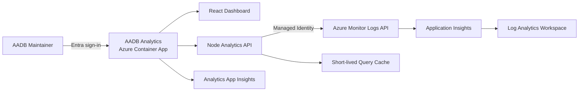

# AADB Product Analytics Initial Recommendations

## Recommended Approach

Build a **separate, private AADB Product Analytics application** as a full-stack React/Node application hosted in **Azure Container Apps**.

This fits the repository because AADB already uses React, Express, managed identity, Container Apps, Application Insights, Log Analytics, and Entra built-in authentication. The new app can reuse those proven patterns without coupling analytics code to the production diagram builder.

## Why This Option

The current workbook is an excellent query prototype. It already includes feature usage, geography, model/token analytics, sessions, growth, and cohort analysis in workbook-content.json and is documented in usage-analytics-workbook.md.

However, a dedicated web app adds capabilities that Workbooks do not handle as elegantly:

- Persistent navigation and product-focused drilldowns
- Period-over-period comparisons
- Cross-filtering between models, features, users, versions, and geography
- Guided funnels and cohort analysis
- Saved views and sharable URLs
- Explanations and maintenance recommendations alongside charts
- A versioned analytics API with automated tests
- Integration of Application Insights data with Cosmos DB feedback

One immediate issue the web app should correct: the workbook’s hard-coded event list omits newer events emitted by telemetryService.ts, including `Validation_Compared`, `Validation_Critique_Ranked`, `Validation_Findings`, `Help_Opened`, `User_Feedback`, and failure telemetry.

## Suggested Experience

Use a restrained operator-dashboard layout, not a marketing-style site:

- **Overview:** DAU/WAU/MAU, returning users, sessions, successful artifacts, change against previous period
- **Journey:** generation → validation → recommendations applied → export → deployment guide
- **Feature adoption:** reach, frequency, repeat usage, first/last use, adoption after release
- **Model intelligence:** calls, latency, tokens, estimated cost, completion rate, validation quality, critique wins
- **Architecture insights:** recurring WAF findings, severity, pillar, model, and secure-default opportunities
- **Reliability:** frontend exceptions, failed dependencies, slow operations, persistence failures
- **Feedback:** sentiment, categories, verbatim Cosmos comments, related model and feature context
- **Retention:** weekly cohorts, return rate, power-user behavior, dormant users
- **Release impact:** compare metrics before and after an AADB version or feature release

Every page should share filters for time range, previous-period comparison, model, operation, country, app version, environment, and user/session segment.

## Backend Design

Keep all Azure Monitor access server-side:

- Use `DefaultAzureCredential` with a dedicated user-assigned managed identity.
- Use the current `@azure/monitor-query-logs` package and `LogsQueryClient`.
- Grant that identity **Log Analytics Reader** only on the relevant workspace.
- Expose named endpoints such as `/api/analytics/overview` and `/api/analytics/model-efficiency`.
- Store KQL in a typed, versioned query registry. Do not accept arbitrary KQL from the browser.
- Validate time ranges and filters, cap result sizes, and use query timeouts.
- Cache aggregated responses for roughly 1–5 minutes.
- Return chart-neutral data contracts so visualizations can change without rewriting KQL.
- Use batch queries where several dashboard panels share the same filter context.

Microsoft’s current JavaScript guidance supports `LogsQueryClient` with `DefaultAzureCredential`: [Azure Monitor Query Logs client library](https://learn.microsoft.com/javascript/api/overview/azure/monitor-query-logs-readme?view=azure-node-latest).

## Azure Hosting

I recommend:

- A new Container App such as `aadb-usage-analytics`
- The existing VNet-integrated Container Apps environment in East US 2
- A separate managed identity from the main AADB identity
- Entra Container Apps built-in authentication
- A separate single-tenant app registration with assignment required
- `minReplicas: 1` and a small maximum initially
- A separate Application Insights component for the analytics application, potentially using the same Log Analytics workspace
- Container image in the existing ACR
- Bicep deployment beside the existing infrastructure

The repository already documents the relevant Entra pattern in APP-ACCESS-AND-AUTH.md. For this sensitive analytics application, assign individual maintainers or a security group. Do not grant access to the shared Diagrammer account.

Official references:

- [Container Apps authentication](https://learn.microsoft.com/azure/container-apps/authentication)
- [Restrict an Entra application to assigned users](https://learn.microsoft.com/entra/identity-platform/howto-restrict-your-app-to-a-set-of-users)
- [Container Apps security](https://learn.microsoft.com/azure/container-apps/security)

## Telemetry Improvements

The dashboards will be considerably more useful if AADB adopts a small telemetry contract upgrade:

- Add `appVersion`, `environment`, `featureVersion`, and `operationId` to every event.
- Track operation started, succeeded, failed, cancelled, and duration consistently.
- Record error categories without prompts, generated content, or sensitive exception text.
- Capture funnel correlation IDs so generation, validation, export, and deployment-guide events can be connected.
- Track useful outcomes, not just clicks.
- Add privacy-safe architecture characteristics such as service count, category counts, WAF pillars, and complexity band.
- Maintain a central event catalog shared by instrumentation, KQL, and tests.
- Add telemetry schema checks so renamed properties cannot silently break dashboards.

Be careful with identity analysis. Browser `user_Id` is generally a pseudonymous client identifier, not a dependable Entra identity, and the shared Diagrammer account obscures individual usage. If stable identity is necessary, emit a one-way tenant-specific hash of the Entra object ID only after completing the appropriate privacy review. Never send UPNs, prompts, architecture content, or access tokens.

## Delivery Plan

1. **MVP:** Reproduce the workbook’s strongest views with shared filters, comparisons, and drilldowns.
2. **Telemetry v2:** Add release metadata, operation outcomes, correlation IDs, and a tested event catalog.
3. **Decision intelligence:** Add funnels, model cost-quality ranking, WAF opportunity analysis, anomaly detection, and weekly maintenance summaries.
4. **Optional AI layer:** Generate evidence-linked product recommendations from pre-aggregated results, never by giving a model unrestricted access to raw telemetry.

I would choose the separate Container Apps application over Static Web Apps because the server-side Azure Monitor access, managed identity, existing ACA environment, Cosmos feedback access, and current deployment conventions all align naturally with it. Power BI or Fabric could later serve broader business reporting, but they would add licensing and semantic-model overhead before the maintenance-focused workflow is proven.
