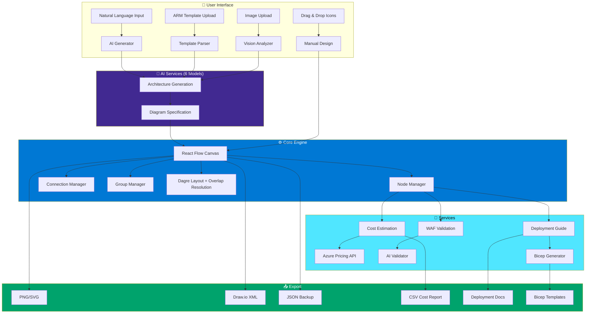
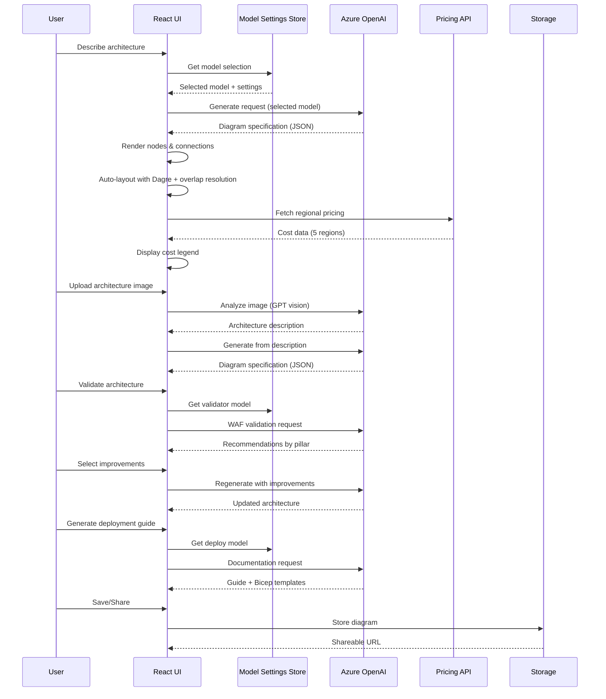
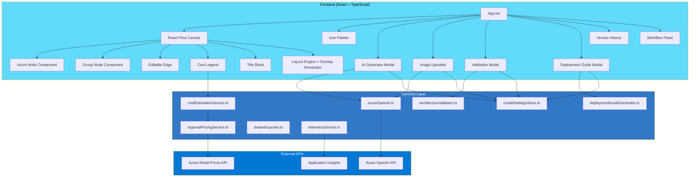

# Azure Architecture Diagram Builder

<div align="center">


**A professional AI-powered tool for designing, validating, and deploying Azure cloud architectures**

[Live Demo](https://azure-diagram-builder.yellowmushroom-f11e57c2.eastus2.azurecontainerapps.io) • [Short Link](https://aka.ms/diagram-builder) • [Documentation](DOCS/ARCHITECTURE.md) • [Report Bug](../../issues)

</div>

---

## 👤 Author

**Arturo Quiroga**  
*Senior Partner Solutions Architect (PSA) - Microsoft*

---

## 📖 Overview

Azure Architecture Diagram Builder is an enterprise-grade web application that empowers cloud architects to design, visualize, validate, and deploy Azure solutions. Leveraging **6 AI models** — **GPT-5.1, GPT-5.2, GPT-5.2 Codex, GPT-5.3 Codex, DeepSeek V3.2 Speciale, and Grok 4.1 Fast** (via Azure OpenAI) — it transforms natural language descriptions into professional architecture diagrams while providing real-time cost estimates, Well-Architected Framework validation, multi-model comparison, and Infrastructure as Code generation.

### Why This Tool?

- **Speed**: Go from idea to deployable architecture in minutes, not hours
- **Accuracy**: Official Azure icons, real-time pricing from Azure Retail Prices API
- **Best Practices**: Built-in WAF validation ensures your architecture follows Microsoft recommendations
- **Actionable Output**: Generate deployment guides with Bicep/ARM templates ready for production

---

## ✨ Key Features

### 🤖 AI-Powered Architecture Generation
Describe your architecture in plain English and let any of 6 AI models (GPT-5.1, GPT-5.2, GPT-5.2 Codex, GPT-5.3 Codex, DeepSeek V3.2 Speciale, or Grok 4.1 Fast) automatically create a complete, professionally organized diagram with logical service groupings.

**13 curated example prompts** included — from simple web apps to complex enterprise scenarios:
- Zero Trust enterprise networks with security segmentation
- Healthcare HIPAA-compliant platforms with FHIR APIs
- Black Friday e-commerce handling 50K orders/hour
- Industrial IoT with 5,000+ sensors and predictive maintenance
- Global multiplayer gaming backends for 500K+ concurrent players
- AI-powered chatbots, document processing, content moderation
- And more...

### 🖼️ Architecture Image Import
Upload an existing architecture diagram image (screenshot, whiteboard photo, or exported PNG) and let AI analyze it to recreate the architecture as an editable, interactive diagram with proper Azure service mapping.

### 📋 ARM Template Import
Import existing ARM templates and automatically visualize your current infrastructure. The AI parses resource dependencies and creates meaningful diagrams. A **glowing purple banner** provides visual feedback during parsing.

### 🎯 Well-Architected Framework Validation
Validate your architecture against all five WAF pillars:
- **Security** — Identity, encryption, network isolation
- **Reliability** — High availability, disaster recovery
- **Performance** — Scaling, caching, optimization
- **Cost Optimization** — Right-sizing, reserved instances
- **Operational Excellence** — Monitoring, automation

Select specific recommendations and automatically regenerate an improved architecture.

### 🔀 Multi-Model Comparison
Compare AI output side-by-side across all 6 models:

- **Architecture Comparison** — Run the same prompt through multiple models and compare service counts, connection counts, groups, workflow steps, token usage, and latency
- **Validation Comparison** — Run WAF validation across models and compare overall scores, pillar-level scores, severity breakdowns, finding counts, and quick wins
- **Save All Diagrams** — Download each model's architecture as a separate JSON file
- **Save Comparison Report** — Download a combined JSON report for offline analysis
- **Apply Winner** — Pick the best result and apply it to the canvas with one click

### 🗂️ Collapse All Groups
Toggle button to collapse or expand all groups at once for a bird's-eye view of the architecture. Restores original group sizes on expand.

### 🔄 Workflow Animation & Data Flow
Visualize how data flows through your architecture step-by-step:
- Interactive step-by-step walkthrough of the architecture
- Service highlighting — each step highlights the involved services on the canvas
- Animated connections showing data flow direction
- AI-generated descriptions for each workflow step

### 📄 Deployment Guide Generation with Bicep
Generate comprehensive deployment documentation including:
- Prerequisites and Azure resource requirements
- Step-by-step deployment instructions
- **Bicep templates** for each service (Infrastructure as Code)
- Post-deployment verification steps
- Security configuration recommendations

### 💰 Real-Time Multi-Region Cost Estimation
Get instant cost estimates across **5 Azure regions**:
- East US 2, Canada Central, Brazil South, West Europe, Sweden Central

Features include:
- Color-coded legend (green/yellow/red based on cost thresholds)
- Export cost breakdown to CSV
- SKU and tier information for each service

### 🧠 Smart Layout Engine
- **Dagre-based hierarchical layout** with compound node support
- **12 AI layout rules** for clean, readable diagrams (directional flow, hub-and-spoke monitoring, connection caps)
- **Automatic group overlap resolution** — post-processing that detects and separates overlapping groups
- **Resizable group nodes** — drag handles to adjust group boundaries

### 📸 Auto-Snapshot & Version History
- Automatically saves a version snapshot before each AI regeneration
- Save named snapshots with descriptions
- Browse and restore previous versions
- Track architecture evolution over time
- Cloud sync with shareable URLs

### 🎨 Professional Diagramming
- **713 Official Azure Icons** — Complete service library across 29 categories
- **68 AI-mapped services** — with pricing, categories, and icon resolution
- **Smart Grouping** — Logical organization (Frontend, Backend, Data, Security)
- **Editable Connections** — Labels, animations, custom styling
- **Alignment Tools** — Professional layout assistance
- **Title Block & Legend** — Document-ready diagrams

### 📤 Export Options
| Format | Use Case |
|--------|----------|
| **PNG** | Documentation, presentations |
| **SVG** | Scalable vector graphics |
| **Draw.io** | Edit in diagrams.net |
| **JSON** | Backup, version control |
| **CSV** | Cost analysis in Excel |

### 📊 Application Insights Telemetry

- **Automatic tracking** — page views, session duration, unique users, geography
- **Feature usage events** — every key action is tracked as a custom event:
  | Event | Properties |
  |-------|------------|
  | `Architecture_Generated` | model, reasoning effort, prompt length, service/connection/group counts, elapsed time, tokens |
  | `Architecture_Validated` | model, overall WAF score, finding count, elapsed time |
  | `DeploymentGuide_Generated` | model, service count, bicep file count, elapsed time |
  | `Diagram_Exported` | format (png/svg/drawio/json/csv), service count |
  | `ARM_Template_Imported` | filename, resource count |
  | `Image_Imported` | — |
  | `Models_Compared` | selected model |
  | `Recommendations_Applied` | recommendation count |
  | `Version_Operation` | save / restore |
  | `Region_Changed` | region ID |
  | `Start_Fresh` | — |
- **Zero-impact when disabled** — if `VITE_APPINSIGHTS_CONNECTION_STRING` is not set, all tracking calls are no-ops
- **Privacy-friendly** — no PII collected; anonymous user IDs via cookies

---

## 🏗️ Architecture

### Application Flow



### Data Flow



### Component Architecture



---

## 🚀 Getting Started

### Prerequisites

- **Node.js 20+** (LTS recommended)
- **npm** or **yarn**
- **Azure OpenAI** resource with GPT model deployment

### Installation

1. **Clone the repository**
```bash
git clone https://github.com/your-org/azure-diagrams.git
cd azure-diagrams
```

2. **Install dependencies**
```bash
npm install
```

3. **Configure environment variables**

Create a `.env` file in the project root:

```bash
# Azure OpenAI Configuration (Required)
VITE_AZURE_OPENAI_ENDPOINT=https://your-resource.openai.azure.com/
VITE_AZURE_OPENAI_API_KEY=your-api-key-here
VITE_AZURE_OPENAI_DEPLOYMENT=your-default-deployment

# Multi-model deployments (6 models)
VITE_AZURE_OPENAI_DEPLOYMENT_GPT51=your-gpt51-deployment
VITE_AZURE_OPENAI_DEPLOYMENT_GPT52=your-gpt52-deployment
VITE_AZURE_OPENAI_DEPLOYMENT_GPT52_CODEX=your-gpt52-codex-deployment
VITE_AZURE_OPENAI_DEPLOYMENT_GPT53_CODEX=your-gpt53-codex-deployment
VITE_AZURE_OPENAI_DEPLOYMENT_DEEPSEEK=your-deepseek-v32-speciale-deployment
VITE_AZURE_OPENAI_DEPLOYMENT_GROK=your-grok-41-fast-deployment

# Reasoning model configuration (GPT-5.x models)
VITE_REASONING_EFFORT=medium  # none | low | medium | high

# Optional: Cloud storage for sharing
AZURE_COSMOS_ENDPOINT=https://your-cosmos.documents.azure.com:443/
COSMOS_DATABASE_ID=diagrams
COSMOS_CONTAINER_ID=diagrams

# Optional: Application Insights telemetry
# Create an App Insights resource in Azure Portal and paste the connection string
VITE_APPINSIGHTS_CONNECTION_STRING=InstrumentationKey=...;IngestionEndpoint=...
```

4. **Start the development server**
```bash
npm run dev
```

5. **Open your browser**
Navigate to `http://localhost:3000`

### Docker Deployment (Local)

```bash
# Build the image (Vite vars must be build args, not runtime env vars)
docker build -t azure-diagram-builder \
  --build-arg VITE_AZURE_OPENAI_ENDPOINT="..." \
  --build-arg VITE_AZURE_OPENAI_API_KEY="..." \
  --build-arg VITE_AZURE_OPENAI_DEPLOYMENT_GPT52="..." \
  --build-arg VITE_AZURE_OPENAI_DEPLOYMENT_GPT41="..." \
  --build-arg VITE_AZURE_OPENAI_DEPLOYMENT_GPT41MINI="..." .

# Optional: include App Insights telemetry
#   --build-arg VITE_APPINSIGHTS_CONNECTION_STRING="..." \

# Run locally
docker run -p 80:80 azure-diagram-builder
```

### Azure Container Apps Deployment

```bash
# 1. Copy and fill in your .env
cp .env.example .env

# 2. Deploy (reads all config from .env)
./scripts/deploy_aca.sh
```

See `.env.example` for all required variables including `ACR_NAME`, `ACA_APP_NAME`, `RESOURCE_GROUP`, and model deployments.

### Securing with Entra ID (Optional)

To restrict access to specific users:

```bash
# 1. Create App Registration
az ad app create --display-name "My Diagram Builder Auth" \
  --sign-in-audience AzureADMyOrg \
  --web-redirect-uris "https://<your-aca-fqdn>/.auth/login/aad/callback" \
  --enable-id-token-issuance true

# 2. Create client secret
az ad app credential reset --id <APP_ID> --years 1

# 3. Enable ACA auth
az containerapp auth microsoft update -g <RG> -n <APP> \
  --client-id <APP_ID> --client-secret <SECRET> \
  --issuer "https://login.microsoftonline.com/<TENANT_ID>/v2.0" --yes

# 4. Require login
az containerapp auth update -g <RG> -n <APP> \
  --unauthenticated-client-action RedirectToLoginPage

# 5. Restrict to specific users
az ad sp create --id <APP_ID>
az ad sp update --id <SP_OBJECT_ID> --set appRoleAssignmentRequired=true
# Then assign users via Azure Portal > Enterprise Applications > Users and groups
```

---

## 📚 Usage Guide

### Creating Diagrams

#### Method 1: AI Generation (Recommended)
1. Click **"AI Generate"** in the toolbar
2. Describe your architecture in natural language, or pick from **13 curated example prompts**
3. Select your AI model (GPT-5.1, GPT-5.2, GPT-5.2 Codex, GPT-5.3 Codex, DeepSeek, or Grok) and reasoning level
4. Click **Generate** — the architecture is created with auto-layout and workflow animation

#### Method 2: Image Import
1. Click **"AI Generate"** and expand the image upload section
2. Upload a screenshot or photo of an existing architecture diagram
3. AI analyzes the image and generates an editable description
4. Click **Generate** to recreate it as an interactive diagram

#### Method 3: ARM Template Import
1. Click **"Import ARM"** in the toolbar
2. Paste your ARM template JSON
3. AI parses and visualizes your existing infrastructure

#### Method 4: Manual Design
1. Browse the icon palette (left sidebar)
2. Drag services onto the canvas
3. Connect services by clicking and dragging between them
4. Double-click labels to edit

### Validating Architecture

1. Design or generate your architecture
2. Click **"Validate Architecture"** in the toolbar
3. Review recommendations by WAF pillar
4. Check the improvements you want to implement
5. Click **"Regenerate with Selected"** to apply

### Comparing Models

#### Architecture Comparison
1. Click **"Compare Models"** in the toolbar
2. Select which models to include and set reasoning effort
3. Enter a prompt (or pick from sample prompts)
4. Click **Compare** — all models run in parallel
5. Review side-by-side results (service count, tokens, latency)
6. Click **"Use This Architecture"** on the best result

#### Validation Comparison
1. Generate an architecture first
2. Click **"Compare Validation"** in the toolbar
3. Select models and click **Compare**
4. Compare WAF scores, pillar breakdowns, severity counts
5. Click **"Use This Validation"** on the preferred result

### Generating Deployment Guide

1. Complete your architecture design
2. Click **"Deployment Guide"** in the toolbar
3. Review the generated documentation:
   - Prerequisites
   - Deployment steps
   - Bicep templates (expandable)
   - Security recommendations
4. Download individual Bicep files or all as ZIP

### Working with Costs

- Costs update automatically as you add services
- Use the **Region Selector** to compare pricing
- Legend shows color-coded cost ranges
- Export to CSV for detailed analysis

---

## 🛠️ Technology Stack

| Category | Technologies |
|----------|-------------|
| **Frontend** | React 18, TypeScript, React Flow, Vite |
| **AI** | Azure OpenAI (GPT-5.1, GPT-5.2, GPT-5.2 Codex, GPT-5.3 Codex, DeepSeek V3.2 Speciale, Grok 4.1 Fast), Dual API (Responses + Chat Completions) |
| **Styling** | CSS3, html-to-image |
| **Serving** | nginx:alpine (Docker), Vite dev server (local) |
| **APIs** | Azure Retail Prices API |
| **Export** | JSZip, Draw.io XML format |
| **Deployment** | Docker, Azure Container Apps |

---

## 📁 Project Structure

```
azure-diagrams/
├── src/
│   ├── components/           # React components
│   │   ├── AIArchitectureGenerator.tsx  # AI generation modal
│   │   ├── ImageUploader.tsx  # Diagram image import
│   │   ├── WorkflowPanel.tsx  # Workflow animation
│   │   ├── ValidationModal.tsx  # WAF validation
│   │   ├── CompareModelsModal.tsx  # Multi-model architecture comparison
│   │   ├── CompareValidationModal.tsx  # Multi-model validation comparison
│   │   ├── DeploymentGuideModal.tsx  # Deployment guides
│   │   ├── ModelSettingsPopover.tsx  # Model selector
│   │   ├── IconPalette.tsx
│   │   ├── AzureNode.tsx / GroupNode.tsx
│   │   ├── Legend.tsx / TitleBlock.tsx
│   │   └── ...
│   ├── services/             # Business logic
│   │   ├── azureOpenAI.ts    # AI integration (Responses + Chat Completions API)
│   │   ├── architectureValidator.ts  # WAF validation with ModelOverride support
│   │   ├── deploymentGuideGenerator.ts  # Guides & Bicep generation
│   │   ├── costEstimationService.ts  # Pricing engine
│   │   ├── drawioExporter.ts  # Draw.io export
│   │   ├── regionalPricingService.ts  # Multi-region pricing
│   │   ├── apiHelper.ts      # Dual API format builder (Responses/Chat Completions)
│   │   ├── versionStorageService.ts  # Version history
│   │   └── telemetryService.ts  # Application Insights telemetry
│   ├── stores/               # State management
│   │   └── modelSettingsStore.ts  # Multi-model settings (6 models)
│   ├── data/                 # Static data
│   │   ├── pricing/          # Regional pricing data (235 files)
│   │   ├── azurePricing.ts   # Service mappings
│   │   └── serviceIconMapping.ts  # Icon mappings
│   ├── utils/                # Utilities
│   │   ├── iconLoader.ts     # Icon matching
│   │   ├── layoutEngine.ts   # Dagre layout + overlap resolution
│   │   ├── layoutPresets.ts  # Reference architectures
│   │   ├── groupUtils.ts     # Shared group collapse/fit utilities
│   │   └── modelNaming.ts    # Model display names
│   └── App.tsx               # Main application
├── scripts/                  # Deployment scripts
│   ├── deploy_aca.sh         # Configurable ACA deployment (reads from .env)
│   └── update_aca.sh         # Author's ACA deployment (hardcoded resources)
├── Azure_Public_Service_Icons/  # 713 official Azure icons (29 categories)
├── DOCS/                     # Documentation
└── Dockerfile               # Container configuration
```

---

## 📖 Documentation

- **[System Architecture](DOCS/ARCHITECTURE.md)** - Technical deep-dive
- **[Layout Engines: Dagre vs ELK](DOCS/LAYOUT_ENGINES_COMPARISON.md)** - Comparison, pros/cons, and best fit analysis
- **[Regional Pricing](DOCS/REGIONAL_PRICING_IMPLEMENTATION.md)** - Cost estimation details
- **[Services Pricing](DOCS/services_pricing.md)** - Supported services and tiers
- **[Icon Mapping](DOCS/ICON_MAPPING.md)** - Service to icon reference

---

## 🌟 What's New

### February 28, 2026 — Multi-Model Expansion & Comparison
- **6-Model Support** — Added GPT-5.1, GPT-5.3 Codex, DeepSeek V3.2 Speciale, and Grok 4.1 Fast alongside existing GPT-5.2 and GPT-5.2 Codex
- **Chat Completions API Adapter** — Dual API support: Responses API for GPT models, Chat Completions API for third-party models (DeepSeek, Grok)
- **Multi-Model Validation Comparison** — Compare WAF validation results across all 6 models with score, pillar, severity, and finding breakdowns
- **Collapse All Groups** — Toggle button to collapse/expand all groups for bird's-eye view, with size persistence
- **ARM Parsing Banner** — Glowing purple gradient banner during ARM template parsing
- **Six-Model Comparison Report** — Formal analysis document ranking all 6 models across 4 prompts
- **Save All Diagrams** — Download each model's architecture comparison result as individual JSON files
- **Save Comparison Report** — Download combined comparison results as a single JSON for offline analysis
- **Shared Group Utilities** — Extracted `fitGroupToContent` into reusable `groupUtils.ts`
- **Bug Fixes** — Fixed Grok 404/string-groups crash, DeepSeek circular parent crash, `kbStats.serviceCount` typo

### February 14, 2026 — UI Polish, Auth & Deployment
- **Entra ID Authentication** — ACA built-in auth with per-user assignment (no code changes needed)
- **Configurable Deploy Script** — New `scripts/deploy_aca.sh` reads all config from `.env` — clone, configure, deploy
- **GPT-5.2 Codex Deployment Support** — Added to Dockerfile and deploy pipeline
- **Compare Models Button Styling** — Amber gradient with pulse animation, dark mode compatible
- **Remove Share Feature** — Removed broken Share button, Express server, and Cosmos DB backend
- **Categorized AI Prompts** — 6 color-coded categories (Web, Security, IoT, AI, E-commerce, Healthcare) replacing flat list
- **Dark Mode Improvements** — Full dark mode support for AI modal, image uploader, form elements
- **Auto-Collapse Panels** — Icon palette, workflow panel, and legend collapse after AI generation
- **Start Fresh Button** — One-click reset with confirmation to clear entire diagram state
- **Compare Models Verbose Prompts** — 8 sample prompts (4 concise + 4 detailed enterprise scenarios)
- **Form UX Improvements** — Textarea above image upload, purple/blue fill colors, improved labels
- **Dockerfile Optimized** — Switched from Node.js server to nginx:alpine static serving
- **Sidebar Search Fix** — Icon search now works across all categories
- **Azure Backup Icon Fix** — Corrected category mapping
- **Stream Analytics Alias Fix** — Corrected icon resolution
- **Power BI Embedded Pricing** — Added missing pricing data
- **Azure Functions & Stream Analytics Pricing** — Added regional pricing data
- **Dashboard Services** — Added Power BI, Grafana, Azure Dashboard to icon mapping

### February 2026 — Core Features
- **Architecture Image Import** — Upload diagram images for AI-powered recreation
- **Workflow Animation Panel** — Step-by-step data flow visualization with service highlighting
- **Multi-Model Support** — GPT-5.1, GPT-5.2, GPT-5.2 Codex, GPT-5.3 Codex, DeepSeek V3.2 Speciale, Grok 4.1 Fast with per-feature overrides
- **Dual API Support** — Responses API for GPT models, Chat Completions API for third-party models
- **Model Selector UI** — Toolbar dropdown with reasoning effort configuration
- **Model Comparison** — Side-by-side architecture and validation comparison across all models
- **Bicep Templates** — IaC generation in deployment guides
- **Reasoning Effort** — Configurable AI thinking depth (GPT-5.x: none/low/medium/high)
- **Smart Layout Engine** — Dagre-based auto-layout with group overlap resolution
- **ELK.js Layout Engine** — Alternative layout with toggle
- **Microsoft Logo** — Added to header banner
- **12 AI Layout Rules** — Directional flow, hub-and-spoke, connection caps, cross-group edge minimization
- **Auto-Snapshot** — Automatic version save before AI regeneration
- **13 Curated Example Prompts** — Security, healthcare, gaming, e-commerce, IoT, AI services
- **68 Mapped Azure Services** — Full icon resolution, categorization, and pricing
- **Resizable Group Nodes** — Drag handles to adjust group boundaries
- **Iterative Regeneration** — Regenerate with selected WAF improvements applied
- **Security-Focused Prompts** — Zero Trust, SOC, and enterprise security scenarios
- **ModelBadge** — Shows which AI model generated the current diagram
- **Chat Completions Fallback** — Automatic fallback for models not supporting Responses API
- **Two-Row Toolbar** — Split toolbar for better fit on normal-width windows

### January 2026
- **WAF Validation** — Well-Architected Framework checks across all 5 pillars
- **Iterative Improvement** — Select and apply WAF recommendations
- **Version History** — Named snapshots with time travel
- **Draw.io Export** — Edit in diagrams.net
- **5 Azure Regions** — Multi-region cost comparison

---

## 🤝 Contributing

This project welcomes contributions and suggestions. Most contributions require you to agree to a
Contributor License Agreement (CLA) declaring that you have the right to, and actually do, grant us
the rights to use your contribution. For details, visit https://cla.opensource.microsoft.com.

When you submit a pull request, a CLA bot will automatically determine whether you need to provide
a CLA and decorate the PR appropriately. Simply follow the instructions provided by the bot.

This project has adopted the [Microsoft Open Source Code of Conduct](https://opensource.microsoft.com/codeofconduct/).
For more information see the [Code of Conduct FAQ](https://opensource.microsoft.com/codeofconduct/faq/) or
contact [opencode@microsoft.com](mailto:opencode@microsoft.com) with any additional questions or comments.

See [CONTRIBUTING.md](CONTRIBUTING.md) for detailed guidelines.

---

## 📄 License

This project is licensed under the [MIT License](LICENSE).

This project uses the official Microsoft Azure icon library. Please refer to [Microsoft's usage guidelines](https://docs.microsoft.com/en-us/azure/architecture/icons/) for the icons.

---

## ™️ Trademarks

This project may contain trademarks or logos for projects, products, or services. Authorized use of Microsoft
trademarks or logos is subject to and must follow
[Microsoft's Trademark & Brand Guidelines](https://www.microsoft.com/en-us/legal/intellectualproperty/trademarks/usage/general).
Use of Microsoft trademarks or logos in modified versions of this project must not cause confusion or imply Microsoft sponsorship.
Any use of third-party trademarks or logos are subject to those third-party's policies.

---

<div align="center">

**Built with ❤️ for the Azure community**

*Empowering cloud architects to design better solutions faster*

</div>
