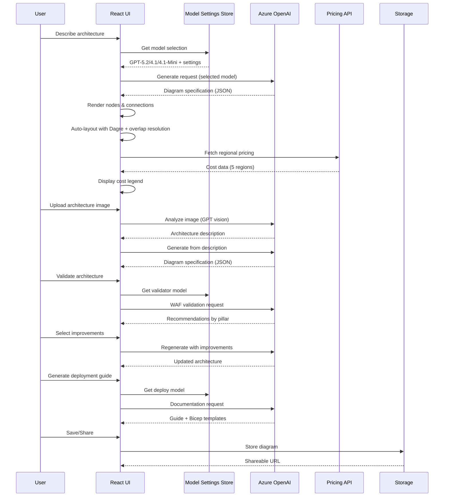
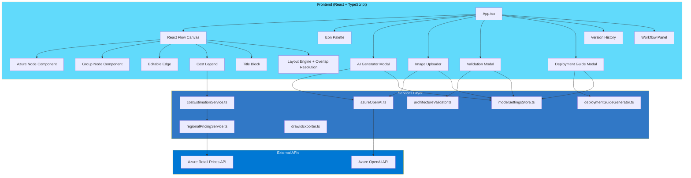

# Azure Architecture Diagram Builder

<div align="center">


**A professional AI-powered tool for designing, validating, and deploying Azure cloud architectures**

[Live Demo](https://azure-diagram-builder.yellowmushroom-f11e57c2.eastus2.azurecontainerapps.io) • [Documentation](DOCS/ARCHITECTURE.md) • [Report Bug](../../issues)

</div>

---

## 👤 Author

**Arturo Quiroga**  
*Senior Partner Solutions Architect (PSA) - Microsoft*

---

## 📖 Overview

Azure Architecture Diagram Builder is an enterprise-grade web application that empowers cloud architects to design, visualize, validate, and deploy Azure solutions. Leveraging **GPT-5.2, GPT-4.1, and GPT-4.1 Mini** (Azure OpenAI), it transforms natural language descriptions into professional architecture diagrams while providing real-time cost estimates, Well-Architected Framework validation, and Infrastructure as Code generation.

### Why This Tool?

- **Speed**: Go from idea to deployable architecture in minutes, not hours
- **Accuracy**: Official Azure icons, real-time pricing from Azure Retail Prices API
- **Best Practices**: Built-in WAF validation ensures your architecture follows Microsoft recommendations
- **Actionable Output**: Generate deployment guides with Bicep/ARM templates ready for production

---

## ✨ Key Features

### 🤖 AI-Powered Architecture Generation
Describe your architecture in plain English and let GPT-5.2 (or GPT-4.1/GPT-4.1 Mini) automatically create a complete, professionally organized diagram with logical service groupings.

**13 curated example prompts** included — from simple web apps to complex enterprise scenarios:
- Zero Trust enterprise networks with security segmentation
- Healthcare HIPAA-compliant platforms with FHIR APIs
- Black Friday e-commerce handling 50K orders/hour
- Industrial IoT with 5,000+ sensors and predictive maintenance
- Global multiplayer gaming backends for 500K+ concurrent players
- AI-powered chatbots, document processing, content moderation
- And more...

### 🖼️ Architecture Image Import
Upload an existing architecture diagram image (screenshot, whiteboard photo, or exported PNG) and let AI analyze it to recreate the architecture as an editable, interactive diagram with proper Azure service mapping.

### 📋 ARM Template Import
Import existing ARM templates and automatically visualize your current infrastructure. The AI parses resource dependencies and creates meaningful diagrams.

### 🎯 Well-Architected Framework Validation
Validate your architecture against all five WAF pillars:
- **Security** - Identity, encryption, network isolation
- **Reliability** - High availability, disaster recovery
- **Performance** - Scaling, caching, optimization
- **Cost Optimization** - Right-sizing, reserved instances
- **Operational Excellence** - Monitoring, automation

Select specific recommendations and automatically regenerate an improved architecture.

### 🔄 Workflow Animation & Data Flow
Visualize how data flows through your architecture step-by-step:
- Interactive step-by-step walkthrough of the architecture
- Service highlighting — each step highlights the involved services on the canvas
- Animated connections showing data flow direction
- AI-generated descriptions for each workflow step

### 📄 Deployment Guide Generation with Bicep
Generate comprehensive deployment documentation including:
- Prerequisites and Azure resource requirements
- Step-by-step deployment instructions
- **Bicep templates** for each service (Infrastructure as Code)
- Post-deployment verification steps
- Security configuration recommendations

### 💰 Real-Time Multi-Region Cost Estimation
Get instant cost estimates across **5 Azure regions**:
- East US 2, Canada Central, Brazil South, West Europe, Sweden Central

Features include:
- Color-coded legend (green/yellow/red based on cost thresholds)
- Export cost breakdown to CSV
- SKU and tier information for each service

### 🧠 Smart Layout Engine
- **Dagre-based hierarchical layout** with compound node support
- **12 AI layout rules** for clean, readable diagrams (directional flow, hub-and-spoke monitoring, connection caps)
- **Automatic group overlap resolution** — post-processing that detects and separates overlapping groups
- **Resizable group nodes** — drag handles to adjust group boundaries

### 📸 Auto-Snapshot & Version History
- Automatically saves a version snapshot before each AI regeneration
- Save named snapshots with descriptions
- Browse and restore previous versions
- Track architecture evolution over time
- Cloud sync with shareable URLs

### 🎨 Professional Diagramming
- **713 Official Azure Icons** — Complete service library across 29 categories
- **68 AI-mapped services** — with pricing, categories, and icon resolution
- **Smart Grouping** — Logical organization (Frontend, Backend, Data, Security)
- **Editable Connections** — Labels, animations, custom styling
- **Alignment Tools** — Professional layout assistance
- **Title Block & Legend** — Document-ready diagrams

### 📤 Export Options
| Format | Use Case |
|--------|----------|
| **PNG** | Documentation, presentations |
| **SVG** | Scalable vector graphics |
| **Draw.io** | Edit in diagrams.net |
| **JSON** | Backup, version control |
| **CSV** | Cost analysis in Excel |

---

## 🏗️ Architecture

### Application Flow


### Data Flow



### Component Architecture



---

## 🚀 Getting Started

### Prerequisites

- **Node.js 20+** (LTS recommended)
- **npm** or **yarn**
- **Azure OpenAI** resource with GPT model deployment

### Installation

1. **Clone the repository**
```bash
git clone https://github.com/your-org/azure-diagrams.git
cd azure-diagrams
```

2. **Install dependencies**
```bash
npm install
```

3. **Configure environment variables**

Create a `.env` file in the project root:

```bash
# Azure OpenAI Configuration (Required)
VITE_AZURE_OPENAI_ENDPOINT=https://your-resource.openai.azure.com/
VITE_AZURE_OPENAI_API_KEY=your-api-key-here
VITE_AZURE_OPENAI_DEPLOYMENT=your-default-deployment

# Multi-model deployments
VITE_AZURE_OPENAI_DEPLOYMENT_GPT52=your-gpt52-deployment
VITE_AZURE_OPENAI_DEPLOYMENT_GPT41=your-gpt41-deployment
VITE_AZURE_OPENAI_DEPLOYMENT_GPT41MINI=your-gpt41mini-deployment

# Reasoning model configuration (GPT-5.2 only)
VITE_REASONING_EFFORT=medium  # none | low | medium | high

# Optional: Cloud storage for sharing
AZURE_COSMOS_ENDPOINT=https://your-cosmos.documents.azure.com:443/
COSMOS_DATABASE_ID=diagrams
COSMOS_CONTAINER_ID=diagrams
```

4. **Start the development server**
```bash
npm run dev
```

5. **Open your browser**
Navigate to `http://localhost:3000`

### Docker Deployment

```bash
# Build the image
docker build -t azure-diagram-builder .

# Run locally
docker run -p 80:80 \
  -e VITE_AZURE_OPENAI_ENDPOINT="..." \
  -e VITE_AZURE_OPENAI_API_KEY="..." \
  -e VITE_AZURE_OPENAI_DEPLOYMENT="..." \
  azure-diagram-builder
```

---

## 📚 Usage Guide

### Creating Diagrams

#### Method 1: AI Generation (Recommended)
1. Click **"AI Generate"** in the toolbar
2. Describe your architecture in natural language, or pick from **13 curated example prompts**
3. Select your AI model (GPT-5.2 / GPT-4.1 / GPT-4.1 Mini) and reasoning level
4. Click **Generate** — the architecture is created with auto-layout and workflow animation

#### Method 2: Image Import
1. Click **"AI Generate"** and expand the image upload section
2. Upload a screenshot or photo of an existing architecture diagram
3. AI analyzes the image and generates an editable description
4. Click **Generate** to recreate it as an interactive diagram

#### Method 3: ARM Template Import
1. Click **"Import ARM"** in the toolbar
2. Paste your ARM template JSON
3. AI parses and visualizes your existing infrastructure

#### Method 4: Manual Design
1. Browse the icon palette (left sidebar)
2. Drag services onto the canvas
3. Connect services by clicking and dragging between them
4. Double-click labels to edit

### Validating Architecture

1. Design or generate your architecture
2. Click **"Validate"** in the toolbar
3. Review recommendations by WAF pillar
4. Check the improvements you want to implement
5. Click **"Regenerate with Selected"** to apply

### Generating Deployment Guide

1. Complete your architecture design
2. Click **"Deployment Guide"** in the toolbar
3. Review the generated documentation:
   - Prerequisites
   - Deployment steps
   - Bicep templates (expandable)
   - Security recommendations
4. Download individual Bicep files or all as ZIP

### Working with Costs

- Costs update automatically as you add services
- Use the **Region Selector** to compare pricing
- Legend shows color-coded cost ranges
- Export to CSV for detailed analysis

---

## 🛠️ Technology Stack

| Category | Technologies |
|----------|-------------|
| **Frontend** | React 18, TypeScript, React Flow, Vite |
| **AI** | Azure OpenAI (GPT-5.2, GPT-4.1, GPT-4.1 Mini), Reasoning Models |
| **Styling** | CSS3, html-to-image |
| **Backend** | Node.js, Express (optional API server) |
| **Storage** | Azure Cosmos DB, Azure Blob Storage |
| **APIs** | Azure Retail Prices API |
| **Export** | JSZip, Draw.io XML format |
| **Deployment** | Docker, Azure Container Apps |

---

## 📁 Project Structure

```
azure-diagrams/
├── src/
│   ├── components/           # React components
│   │   ├── AIArchitectureGenerator.tsx  # AI generation modal
│   │   ├── ImageUploader.tsx  # Diagram image import (180 lines)
│   │   ├── WorkflowPanel.tsx  # Workflow animation (68 lines)
│   │   ├── ValidationModal.tsx  # WAF validation
│   │   ├── DeploymentGuideModal.tsx  # Deployment guides
│   │   ├── ModelSettingsPopover.tsx  # Model selector (242 lines)
│   │   ├── IconPalette.tsx
│   │   ├── AzureNode.tsx / GroupNode.tsx
│   │   ├── Legend.tsx / TitleBlock.tsx
│   │   └── ...
│   ├── services/             # Business logic
│   │   ├── azureOpenAI.ts    # AI integration (565 lines)
│   │   ├── architectureValidator.ts  # WAF validation (355 lines)
│   │   ├── deploymentGuideGenerator.ts  # Guides & Bicep (396 lines)
│   │   ├── costEstimationService.ts  # Pricing (401 lines)
│   │   ├── drawioExporter.ts  # Draw.io export (414 lines)
│   │   ├── regionalPricingService.ts  # Multi-region (352 lines)
│   │   ├── versionStorageService.ts  # Version history (177 lines)
│   │   └── ...
│   ├── stores/               # State management
│   │   └── modelSettingsStore.ts  # Multi-model settings (271 lines)
│   ├── data/                 # Static data
│   │   ├── pricing/          # Regional pricing data (235 files)
│   │   ├── azurePricing.ts   # Service mappings (1,059 lines)
│   │   └── serviceIconMapping.ts  # Icon mappings (885 lines)
│   ├── utils/                # Utilities
│   │   ├── iconLoader.ts     # Icon matching (113 lines)
│   │   ├── layoutEngine.ts   # Dagre layout + overlap resolution (345 lines)
│   │   ├── layoutPresets.ts  # Reference architectures (460 lines)
│   │   └── modelNaming.ts    # Model display names (76 lines)
│   └── App.tsx               # Main application (2,735 lines)
├── server/                   # Backend API (Express.js, port 8787)
├── Azure_Public_Service_Icons/  # 713 official Azure icons (29 categories)
├── DOCS/                     # Documentation
└── Dockerfile               # Container configuration
```

---

## 📖 Documentation

- **[System Architecture](DOCS/ARCHITECTURE.md)** - Technical deep-dive
- **[Regional Pricing](DOCS/REGIONAL_PRICING_IMPLEMENTATION.md)** - Cost estimation details
- **[Services Pricing](DOCS/services_pricing.md)** - Supported services and tiers
- **[Icon Mapping](DOCS/ICON_MAPPING.md)** - Service to icon reference

---

## 🌟 What's New

### February 2026
- **Architecture Image Import** — Upload diagram images for AI-powered recreation
- **Workflow Animation Panel** — Step-by-step data flow visualization with service highlighting
- **Multi-Model Support** — GPT-5.2, GPT-4.1, GPT-4.1 Mini with per-feature overrides
- **Model Selector UI** — Toolbar dropdown with reasoning effort configuration
- **Model Comparison Reports** — Side-by-side architecture quality analysis across all models
- **Bicep Templates** — IaC generation in deployment guides
- **Reasoning Effort** — Configurable AI thinking depth (GPT-5.2: low/medium/high)
- **Smart Layout Engine** — Dagre-based auto-layout with group overlap resolution
- **12 AI Layout Rules** — Directional flow, hub-and-spoke, connection caps, cross-group edge minimization
- **Auto-Snapshot** — Automatic version save before AI regeneration
- **13 Curated Example Prompts** — Security, healthcare, gaming, e-commerce, IoT, AI services
- **68 Mapped Azure Services** — Full icon resolution, categorization, and pricing
- **Resizable Group Nodes** — Drag handles to adjust group boundaries
- **Iterative Regeneration** — Regenerate with selected WAF improvements applied
- **Security-Focused Prompts** — Zero Trust, SOC, and enterprise security scenarios

### January 2026
- **WAF Validation** — Well-Architected Framework checks across all 5 pillars
- **Iterative Improvement** — Select and apply WAF recommendations
- **Version History** — Named snapshots with time travel
- **Draw.io Export** — Edit in diagrams.net
- **5 Azure Regions** — Multi-region cost comparison

---

## 🤝 Contributing

Contributions are welcome! Please feel free to submit a Pull Request.

1. Fork the repository
2. Create your feature branch (`git checkout -b feature/amazing-feature`)
3. Commit your changes (`git commit -m 'Add amazing feature'`)
4. Push to the branch (`git push origin feature/amazing-feature`)
5. Open a Pull Request

---

## 📄 License

This project uses the official Microsoft Azure icon library. Please refer to [Microsoft's usage guidelines](https://docs.microsoft.com/en-us/azure/architecture/icons/) for the icons.

---

<div align="center">

**Built with ❤️ for the Azure community**

*Empowering cloud architects to design better solutions faster*

</div>
